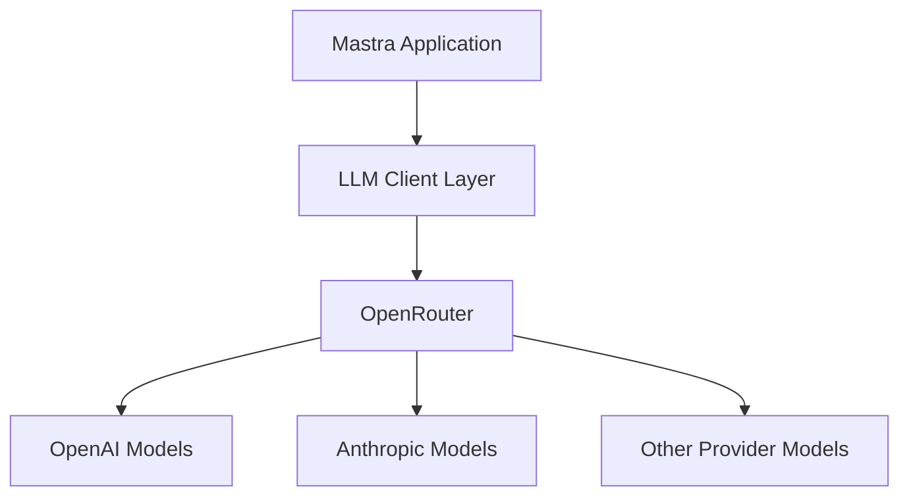

# Mastra OpenRouter Integration

## Purpose
This document details the integration of OpenRouter as the primary AI provider for the Mastra framework, replacing the default Anthropic provider.

## Classification
- **Domain:** External Integration
- **Stability:** Stable
- **Abstraction:** Implementation
- **Confidence:** High

## Content

### Overview

Mastra supports multiple LLM providers, with Anthropic configured as the default in the base project. This document outlines the steps and configuration needed to use OpenRouter as the primary LLM provider instead. OpenRouter acts as an API gateway to multiple LLM providers, allowing for more flexibility in model selection and failover capabilities.



### Core Components

#### 1. LLM Client Configuration

Mastra uses the AI SDK to interact with various LLM providers. To use OpenRouter, we need to configure the appropriate client in our application:

```typescript
// src/mastra/index.ts
import { Mastra } from 'mastra';
import { openrouter } from '@ai-sdk/openrouter';

// Create a Mastra instance with OpenRouter as the LLM provider
export const mastra = new Mastra({
  llm: {
    provider: 'openrouter',
    apiKey: Deno.env.get('OPENROUTER_API_KEY'),
    defaultModel: 'openai/gpt-4o' // or any other model available via OpenRouter
  },
  // other configuration options...
});
```

#### 2. Environment Variables

The OpenRouter integration requires setting up the appropriate environment variables:

```bash
# .env file
OPENROUTER_API_KEY=your_openrouter_api_key
OPENROUTER_DEFAULT_MODEL=openai/gpt-4o  # Optional, can be set in code
```

#### 3. Model Selection

OpenRouter provides access to various models from different providers. When configuring agents or workflows, you can specify which model to use:

```typescript
// src/mastra/agents/example.ts
import { Agent } from 'mastra';
import { openrouter } from '@ai-sdk/openrouter';

export const exampleAgent = new Agent({
  name: 'Example Agent',
  instructions: 'You are a helpful assistant...',
  model: openrouter('openai/gpt-4o'),
  // other configuration options...
});
```

Common models available through OpenRouter include:
- `openai/gpt-4o`
- `openai/gpt-4-turbo`
- `anthropic/claude-3-opus`
- `anthropic/claude-3-sonnet`
- `meta/llama-3-70b-instruct`

### Implementation Steps

#### 1. Install Dependencies

Ensure the OpenRouter AI SDK package is installed:

```bash
deno add @ai-sdk/openrouter
```

#### 2. Update Mastra Configuration

Update the main Mastra configuration file to use OpenRouter:

```typescript
// src/mastra/index.ts
import { Mastra } from 'mastra';
import { openrouter } from '@ai-sdk/openrouter';

export const mastra = new Mastra({
  llm: {
    provider: 'openrouter',
    apiKey: Deno.env.get('OPENROUTER_API_KEY'),
    defaultModel: Deno.env.get('OPENROUTER_DEFAULT_MODEL') || 'openai/gpt-4o'
  },
  // other configuration...
});
```

#### 3. Update Agent Definitions

Update individual agent definitions to use OpenRouter models:

```typescript
// src/mastra/agents/dialogueAgent.ts
import { Agent } from 'mastra';
import { openrouter } from '@ai-sdk/openrouter';

export const dialogueAgent = new Agent({
  name: 'Dialogue Agent',
  instructions: 'You are a dialogue agent that...',
  model: openrouter('openai/gpt-4o'),
  // other configuration...
});
```

#### 4. Configure Rate Limiting and Fallbacks (Optional)

For production use, consider setting up rate limiting and fallback models:

```typescript
// src/mastra/index.ts
import { Mastra } from 'mastra';
import { openrouter } from '@ai-sdk/openrouter';

export const mastra = new Mastra({
  llm: {
    provider: 'openrouter',
    apiKey: Deno.env.get('OPENROUTER_API_KEY'),
    defaultModel: 'openai/gpt-4o',
    rateLimit: {
      maxRequestsPerMinute: 60,
      maxTokensPerMinute: 100000
    },
    fallbacks: [
      'anthropic/claude-3-haiku',
      'meta/llama-3-8b-instruct'
    ]
  },
  // other configuration...
});
```

### Usage in Workflows

When defining workflows, you can specify which OpenRouter model to use for each step:

```typescript
// src/mastra/workflows/exampleWorkflow.ts
import { Workflow, Step } from 'mastra';
import { openrouter } from '@ai-sdk/openrouter';

const step1 = new Step({
  id: 'step1',
  execute: async ({ context }) => {
    const llm = openrouter('openai/gpt-4o');
    const result = await llm.complete(`
      Analyze the following text and provide key points:
      ${context.input}
    `);
    return { analysis: result };
  }
});

// Define workflow
export const exampleWorkflow = new Workflow({
  name: 'example-workflow',
  steps: [step1]
});
```

### Advanced Configuration

#### Model Routing by Task Type

For advanced use cases, you might want to route different types of tasks to different models:

```typescript
// src/mastra/utils/modelSelector.ts
import { openrouter } from '@ai-sdk/openrouter';

export function selectModelForTask(taskType: string) {
  switch (taskType) {
    case 'creative':
      return openrouter('anthropic/claude-3-opus');
    case 'code':
      return openrouter('openai/gpt-4o');
    case 'summarization':
      return openrouter('anthropic/claude-3-haiku');
    default:
      return openrouter('openai/gpt-4o');
  }
}
```

#### Cost Optimization

To optimize costs, you can implement logic to select models based on complexity:

```typescript
// src/mastra/utils/modelSelector.ts
import { openrouter } from '@ai-sdk/openrouter';

export function selectModelByComplexity(input: string, complexity: 'low' | 'medium' | 'high') {
  switch (complexity) {
    case 'low':
      return openrouter('meta/llama-3-8b-instruct');
    case 'medium':
      return openrouter('anthropic/claude-3-haiku');
    case 'high':
      return openrouter('openai/gpt-4o');
  }
}
```

### Troubleshooting

Common issues when integrating OpenRouter:

1. **Authentication Errors**:
   - Ensure the `OPENROUTER_API_KEY` is correctly set in your environment
   - Verify the API key is valid in the OpenRouter dashboard

2. **Model Availability**:
   - Check that the requested model is available through OpenRouter
   - Consider implementing fallbacks for when specific models are unavailable

3. **Rate Limiting**:
   - Implement appropriate rate limiting in your application
   - Monitor usage to avoid unexpected costs

4. **Error Handling**:
   - Implement robust error handling for API requests
   - Log errors and implement retries with exponential backoff

## Relationships
- **Parent Nodes:** 
  - [elements/mastra/index.md]
- **Child Nodes:** None
- **Related Nodes:** 
  - [elements/multi-agent-dialogue/mastra_integration.md] - uses Mastra with OpenRouter
  - [elements/deno/development_workflow.md] - development environment setup

## Navigation Guidance
- **Access Context:** Use this document to configure OpenRouter as the primary LLM provider in Mastra
- **Common Next Steps:** Configure specific agents and workflows to use OpenRouter models
- **Related Tasks:** Environment variable configuration, LLM client integration
- **Update Patterns:** Update when changing default models or adding new OpenRouter features

## Metadata
- **Created:** 2025-05-31
- **Last Updated:** 2025-05-31
- **Updated By:** AI Assistant

## Change History
- 2025-05-31: Initial creation
