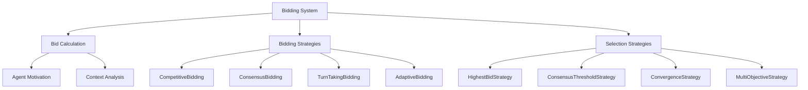

# Multi-Agent Dialogue Bidding Strategies

## Purpose
This document details the bidding strategies used to determine speaking order and turn-taking in the multi-agent dialogue system.

## Classification
- **Domain:** Interaction Management
- **Stability:** Semi-stable
- **Abstraction:** Structural
- **Confidence:** High

## Content

### Overview

Bidding strategies are mechanisms that determine which agent speaks next in a dialogue. They represent different ways to manage turn-taking and conversation flow. In our motivation-driven architecture, agents calculate their desire to speak (their "bid"), and bidding strategies use these bids to select the next speaker based on specific goals or constraints.



### Core Components

#### 1. Bid Calculation

Before a bidding strategy can select the next speaker, each agent must calculate their bid value:

```typescript
// Simplified example of bid calculation within an agent
async calculateBid(context: BiddingContext): Promise<BidResult> {
  // Context influences bidding
  const contextModifier = this.calculateContextModifier(context);
  
  // Aggregate desires from all motivations
  const desires = await Promise.all(
    this.motivations.map(m => 
      m.calculateDesire(this, this.motivationStates.get(m.id)!, context)
    )
  );
  
  // Combine desires based on agent's personality and context
  const aggregatedDesire = this.aggregateDesires(desires) * contextModifier;
  
  return {
    value: aggregatedDesire,
    reasoning: this.explainBid(desires),
    motivationBreakdown: this.getMotivationBreakdown(desires),
    contextInfluence: this.explainContextInfluence(contextModifier)
  };
}
```

A complete bid result includes:
- **Value**: A number between 0-1 representing desire to speak
- **Reasoning**: Natural language explanation of why the agent wants to speak
- **Motivation Breakdown**: Contribution of each motivation to the bid
- **Context Influence**: How conversational context affected the bid

#### 2. Bidding Strategy Interface

All bidding strategies implement the `IBiddingStrategy` interface:

```typescript
export interface IBiddingStrategy {
  name: string;
  
  // Calculate final bid value after applying strategy-specific adjustments
  calculateBid(
    agent: MotivatedAgent,
    context: BiddingContext
  ): Promise<BidResult>;
  
  // Optional: can provide a reason for the strategy's adjustment
  explainAdjustment?(
    originalBid: BidResult,
    adjustedBid: BidResult,
    context: BiddingContext
  ): string;
}
```

#### 3. Selection Strategy Interface

Selection strategies determine which agent speaks next based on the bids:

```typescript
export interface ISelectionStrategy {
  name: string;
  
  // Select the next speaking agent based on bids and context
  selectNextSpeaker(
    agents: MotivatedAgent[],
    context: SimulationContext
  ): Promise<DialogueAgent | null>;
  
  // Optional: explain why this agent was selected
  explainSelection?(
    selectedAgent: DialogueAgent,
    allAgents: MotivatedAgent[],
    context: SimulationContext
  ): string;
}
```

### Bidding Strategy Implementations

#### 1. CompetitiveBidding

In competitive bidding, agents aim to maximize their chance of speaking by bidding as high as possible when they have something important to say:

```typescript
export class CompetitiveBidding implements IBiddingStrategy {
  name = 'competitive';
  
  async calculateBid(
    agent: MotivatedAgent,
    context: BiddingContext
  ): Promise<BidResult> {
    const baseDesire = await agent.calculateBid(context);
    
    // In competitive mode, we boost assertiveness
    // Agents with stronger opinions will bid higher
    const assertiveness = this.calculateAssertiveness(agent, context);
    const expertiseRelevance = this.calculateExpertiseRelevance(agent, context);
    
    const adjustedValue = baseDesire.value * (1 + assertiveness * 0.3 + expertiseRelevance * 0.2);
    
    return {
      ...baseDesire,
      value: Math.min(1, adjustedValue), // Cap at 1
      strategy: 'competitive'
    };
  }
  
  private calculateAssertiveness(agent: MotivatedAgent, context: BiddingContext): number {
    // Analyze agent's assertiveness based on personality or past behavior
    return agent.metadata.assertiveness || 0.5;
  }
  
  private calculateExpertiseRelevance(agent: MotivatedAgent, context: BiddingContext): number {
    // Check if current topic matches agent's expertise
    // Higher score if agent is an expert on the current topic
    const expertise = agent.context.expertise || [];
    const topicRelevance = expertise.some(e => 
      context.currentTopic.toLowerCase().includes(e.toLowerCase())
    ) ? 0.8 : 0.2;
    
    return topicRelevance;
  }
}
```

#### 2. ConsensusBidding

Consensus bidding prioritizes building agreement and reduces contention when consensus is forming:

```typescript
export class ConsensusBidding implements IBiddingStrategy {
  name = 'consensus';
  
  async calculateBid(
    agent: MotivatedAgent,
    context: BiddingContext
  ): Promise<BidResult> {
    const baseDesire = await agent.calculateBid(context);
    const consensusLevel = await this.measureConsensus(context);
    
    // Inverse relationship: lower bids as consensus increases
    // This prevents disruption when agreement is forming
    const adjustedValue = baseDesire.value * (1 - consensusLevel * 0.8);
    
    return {
      ...baseDesire,
      value: adjustedValue,
      strategy: 'consensus-adjusted'
    };
  }
  
  private async measureConsensus(context: BiddingContext): Promise<number> {
    const analyzer = new AgreementCalculator();
    return analyzer.calculateOverallAgreement(context.dialogueHistory);
  }
}
```

#### 3. TurnTakingBidding

Turn-taking bidding ensures balanced participation by implementing structured turns:

```typescript
export class TurnTakingBidding implements IBiddingStrategy {
  name = 'turn-taking';
  
  constructor(
    private config: TurnTakingConfig = {
      turnOrder: 'sequential', // or 'priority-based'
      waitingPenalty: 0.2,
      recentSpeakerPenalty: 0.8
    }
  ) {}
  
  async calculateBid(
    agent: MotivatedAgent,
    context: BiddingContext
  ): Promise<BidResult> {
    const baseDesire = await agent.calculateBid(context);
    const turnModifier = this.calculateTurnModifier(agent, context);
    
    const adjustedValue = baseDesire.value * turnModifier;
    
    return {
      ...baseDesire,
      value: adjustedValue,
      strategy: 'turn-modified'
    };
  }
  
  private calculateTurnModifier(agent: MotivatedAgent, context: BiddingContext): number {
    // Check when agent last spoke
    const turnsSinceLastSpoke = this.getTurnsSinceLastSpoke(agent.id, context);
    
    // Recently spoke -> lower chance to speak again
    if (turnsSinceLastSpoke === 0) {
      return 1 - this.config.recentSpeakerPenalty;
    }
    
    // Waiting a long time -> higher chance to speak
    const waitingBonus = Math.min(1, turnsSinceLastSpoke * this.config.waitingPenalty);
    return 1 + waitingBonus;
  }
  
  private getTurnsSinceLastSpoke(agentId: string, context: BiddingContext): number {
    const recentTurns = context.dialogueHistory.slice(-10);
    for (let i = recentTurns.length - 1; i >= 0; i--) {
      if (recentTurns[i].agentId === agentId) {
        return recentTurns.length - 1 - i;
      }
    }
    return recentTurns.length; // Never spoke in recent history
  }
}
```

#### 4. AdaptiveBidding

Adaptive bidding dynamically selects strategies based on conversation dynamics:

```typescript
export class AdaptiveBidding implements IBiddingStrategy {
  name = 'adaptive';
  
  private strategies: Map<string, IBiddingStrategy> = new Map();
  
  constructor(strategies: Record<string, IBiddingStrategy>) {
    Object.entries(strategies).forEach(([key, strategy]) => {
      this.strategies.set(key, strategy);
    });
  }

  async calculateBid(
    agent: MotivatedAgent,
    context: BiddingContext
  ): Promise<BidResult> {
    // Analyze dialogue dynamics to choose appropriate strategy
    const dynamics = await this.analyzeDynamics(context);
    const selectedStrategy = this.selectStrategy(dynamics);
    
    const result = await selectedStrategy.calculateBid(agent, context);
    return {
      ...result,
      strategy: `adaptive-${dynamics.mode}`
    };
  }
  
  private async analyzeDynamics(context: BiddingContext): Promise<DialogueDynamics> {
    // Analyze various metrics about dialogue progress
    return {
      mode: this.determineMode(context),
      consensusProgress: await this.measureConsensusProgress(context),
      polarization: await this.measurePolarization(context),
      stagnation: this.measureStagnation(context),
      energyLevel: this.measureEnergyLevel(context)
    };
  }
  
  private selectStrategy(dynamics: DialogueDynamics): IBiddingStrategy {
    if (dynamics.consensusProgress > 0.7) {
      return this.strategies.get('consensus')!;
    } else if (dynamics.polarization > 0.8) {
      return this.strategies.get('mediation')!;
    } else if (dynamics.stagnation > 0.6) {
      return this.strategies.get('provocative')!;
    }
    return this.strategies.get('balanced')!;
  }
}
```

### Selection Strategy Implementations

#### 1. HighestBidStrategy

The simplest selection strategy - chooses the agent with the highest bid:

```typescript
export class HighestBidStrategy implements ISelectionStrategy {
  name = 'highest-bid';
  
  async selectNextSpeaker(
    agents: MotivatedAgent[],
    context: SimulationContext
  ): Promise<DialogueAgent | null> {
    // Collect bids from all agents
    const bids = await this.collectBids(agents, context);
    
    // Find the highest bidder
    let highestBid: BidResult | null = null;
    let highestBidder: DialogueAgent | null = null;
    
    for (let i = 0; i < bids.length; i++) {
      if (!highestBid || bids[i].value > highestBid.value) {
        highestBid = bids[i];
        highestBidder = agents[i];
      }
    }
    
    return highestBidder;
  }
  
  private async collectBids(
    agents: MotivatedAgent[],
    context: SimulationContext
  ): Promise<BidResult[]> {
    return Promise.all(
      agents.map(agent => agent.calculateBid(this.createBiddingContext(context)))
    );
  }
  
  private createBiddingContext(context: SimulationContext): BiddingContext {
    // Convert simulation context to bidding context
    return {
      dialogueHistory: context.history,
      currentTopic: context.currentTopic,
      recentMessages: context.history.slice(-3).map(h => h.message),
      // Other context conversions
    };
  }
}
```

#### 2. ConsensusThresholdStrategy

Uses thresholds to manage speaking turns, with focus on consensus-building:

```typescript
export class ConsensusThresholdStrategy implements ISelectionStrategy {
  name = 'consensus-threshold';
  
  constructor(
    private config: ConsensusThresholdConfig = {
      speakingThreshold: 0.3,
      consensusTarget: 0.8,
      quietPeriodAfterAgreement: 2
    }
  ) {}

  async selectNextSpeaker(
    agents: MotivatedAgent[],
    context: SimulationContext
  ): Promise<DialogueAgent | null> {
    const bids = await this.collectBids(agents, context);
    
    // Check if anyone wants to speak above threshold
    const activeBids = bids.filter(b => b.value > this.config.speakingThreshold);
    
    if (activeBids.length === 0) {
      // No one has strong desire to speak - consensus may be reached
      return null;
    }
    
    // In consensus mode, prefer agents with moderate bids over extreme ones
    // This avoids domination by strongly opinionated agents
    const moderateBids = this.filterModerateBids(activeBids);
    
    if (moderateBids.length > 0) {
      return this.selectFromBids(moderateBids);
    }
    
    return this.selectFromBids(activeBids);
  }
  
  private filterModerateBids(bids: BidResult[]): BidResult[] {
    const avg = bids.reduce((sum, b) => sum + b.value, 0) / bids.length;
    const stdDev = Math.sqrt(
      bids.reduce((sum, b) => sum + Math.pow(b.value - avg, 2), 0) / bids.length
    );
    
    // Select bids within 1 standard deviation of mean
    return bids.filter(b => Math.abs(b.value - avg) <= stdDev);
  }
  
  private selectFromBids(bids: BidResult[]): DialogueAgent {
    // Randomly select from filtered bids
    // This introduces some variability
    const index = Math.floor(Math.random() * bids.length);
    return bids[index].agent;
  }
}
```

#### 3. ConvergenceStrategy

Prioritizes agents whose positions are converging, to facilitate agreement:

```typescript
export class ConvergenceStrategy implements ISelectionStrategy {
  name = 'convergence';
  
  private convergenceTracker = new ConvergenceTracker();
  
  async selectNextSpeaker(
    agents: MotivatedAgent[],
    context: SimulationContext
  ): Promise<DialogueAgent | null> {
    const positions = await this.analyzePositions(agents, context);
    const convergenceMap = this.convergenceTracker.update(positions);
    
    // Identify agents whose positions are converging
    const convergingPairs = this.findConvergingPairs(convergenceMap);
    
    if (convergingPairs.length > 0) {
      // Prioritize agents who are finding common ground
      const [agent1, agent2] = convergingPairs[0];
      
      // Let the one who spoke less recently go next
      const lastSpoke1 = context.lastSpokeAt.get(agent1.id) || -Infinity;
      const lastSpoke2 = context.lastSpokeAt.get(agent2.id) || -Infinity;
      
      return lastSpoke1 < lastSpoke2 ? agent1 : agent2;
    }
    
    // Fall back to standard bid-based selection
    return this.standardSelection(agents, context);
  }
}
```

### Strategy Application to Simulation Modes

Different simulation modes use different bidding and selection strategies:

- **Competitive Mode**: Uses `CompetitiveBidding` with `HighestBidStrategy`
- **Consensus Mode**: Uses `ConsensusBidding` with `ConsensusThresholdStrategy`
- **Deliberative Mode**: Uses `TurnTakingBidding` with `MultiObjectiveStrategy`
- **Adaptive Mode**: Uses `AdaptiveBidding` that selects appropriate strategies

### Customizing Bidding Behavior

Custom bidding strategies can be created by implementing the interfaces:

```typescript
// Example custom bidding strategy for a debate format
export class DebateBidding implements IBiddingStrategy {
  name = 'debate';
  
  constructor(
    private config: DebateConfig = {
      affirmativeBoost: 0.2,
      negativeBoost: 0.2,
      rebuttalsRequired: true
    }
  ) {}
  
  async calculateBid(
    agent: MotivatedAgent,
    context: BiddingContext
  ): Promise<BidResult> {
    const baseDesire = await agent.calculateBid(context);
    
    // Determine which side the agent is on
    const side = this.determineSide(agent);
    
    // Boost depending on debate structure
    // Last speaker was opposite side -> higher chance to respond
    const lastSpeaker = this.getLastSpeaker(context);
    const lastSpeakerSide = lastSpeaker ? this.determineSide(lastSpeaker) : null;
    
    let modifier = 1;
    if (lastSpeakerSide && lastSpeakerSide !== side) {
      modifier += 0.5; // Strong boost for rebuttals
    }
    
    // Apply side-specific boosts at appropriate times
    if (side === 'affirmative' && this.isAffirmativeTurn(context)) {
      modifier += this.config.affirmativeBoost;
    } else if (side === 'negative' && this.isNegativeTurn(context)) {
      modifier += this.config.negativeBoost;
    }
    
    return {
      ...baseDesire,
      value: Math.min(1, baseDesire.value * modifier),
      strategy: 'debate-format'
    };
  }
}
```

## Relationships
- **Parent Nodes:** 
  - [elements/multi-agent-dialogue/architecture.md]
- **Child Nodes:** None
- **Related Nodes:** 
  - [elements/multi-agent-dialogue/motivation_system.md] - provides bids for strategies
  - [elements/multi-agent-dialogue/simulation_modes.md] - configures bidding strategies

## Navigation Guidance
- **Access Context:** Use this document to understand how bidding and turn-taking work in the dialogue system
- **Common Next Steps:** Explore simulation modes to see how bidding strategies are applied
- **Related Tasks:** Implementing new bidding strategies, configuring selection mechanisms
- **Update Patterns:** Update when adding new bidding strategies or selection mechanisms

## Metadata
- **Created:** 2025-05-31
- **Last Updated:** 2025-05-31
- **Updated By:** AI Assistant

## Change History
- 2025-05-31: Initial creation based on multi-agent-dialogue-system.md
