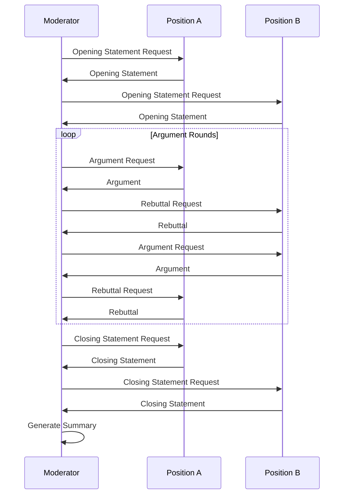

# Debate Workflow Design

## Purpose
This document outlines the design and implementation plan for a specialized debate workflow within the Convenings framework.

## Classification
- **Domain:** Multi-agent Dialogue
- **Stability:** Evolving
- **Abstraction:** Structural
- **Confidence:** Evolving

## Content

### Overview

The Debate Workflow is a specialized dialogue format that enables structured argumentative exchanges between participants with opposing viewpoints. Unlike the standard dialogue or consensus workflows, the debate format focuses on presenting clear positions, supporting evidence, and rebuttals in a structured format.



### Key Features

1. **Structured Format**:
   - Opening statements from each position
   - Multiple rounds of arguments and rebuttals
   - Closing statements
   - Moderator summaries and scoring
   - Index-based output organization for LLM-friendly consumption

2. **Specialized Participant Roles**:
   - Moderator: Guides the debate, enforces rules, summarizes positions
   - Position Advocates: Present and defend specific viewpoints
   - (Optional) Fact Checker: Verifies factual claims made during the debate

3. **Turn Management**:
   - Fixed turn order following debate protocol
   - Time/token limits for each contribution
   - Interruption mechanics for fact-checking or rule enforcement

4. **Scoring Mechanisms**:
   - Logical coherence of arguments
   - Use of evidence and examples
   - Responsiveness to opposing arguments
   - Persuasiveness and clarity

5. **Output Management**:
   - Individual message files to prevent context window issues
   - Index file with metadata and message references
   - Optional full transcript file generation
   - Flexible output formats (JSON, Markdown, Text)

6. **Debate Configurations**:
   - Formal debate: Strict rules, formal language, explicit scoring
   - Casual debate: More flexible structure, conversational tone
   - Educational debate: Focus on learning and exploration of multiple perspectives
   - Competitive debate: Emphasis on persuasion and winning arguments

### Output Structure

The debate workflow generates the following output structure in timestamp-named directories:

```
YYYY-MM-DD/YYYY-MM-DDT00-00-00_debate/
├── index.md              # Main index file with metadata and message references
├── metadata.md           # Debate metadata (config, stats, etc.)
├── summary.md            # Final debate summary
├── messages/             # Individual message files
│   ├── 001_moderator_12345678.md
│   ├── 002_position_advocate_87654321.md
│   └── ...
└── transcript.md         # (Optional) Full transcript file
```

This structure ensures that even large debates with many turns remain accessible to LLMs with limited context windows, as each message can be accessed individually rather than requiring loading a potentially large transcript file.

### Implementation Plan

#### Core Components

1. **DebateWorkflow Class**:
   - Extends DialogueWorkflow with debate-specific logic
   - Implements debate protocol and scoring mechanisms
   - Manages transitions between debate phases

2. **DebateParticipant Interface**:
   - Specialized participant interface for debate roles
   - Methods for opening/closing statements, arguments, rebuttals
   - Support for position-based prompt generation

3. **DebateModeratorParticipant Class**:
   - Specialized participant for debate moderation
   - Methods for scoring, summarizing, and enforcing rules
   - Support for adjusting the debate dynamically

4. **DebateConfiguration Interface**:
   - Configuration options for debate format and rules
   - Scoring criteria and weightings
   - Round structure and timing parameters
   - Output configuration including optional transcript generation

#### Implementation Steps

1. **Define Interfaces**:
   - Create DebateWorkflowConfig interface
   - Design DebateParticipant and DebateModeratorParticipant interfaces
   - Define DebateWorkflowResult with scoring and summary information

2. **Implement Core Classes**:
   - Develop DebateWorkflow class extending DialogueWorkflow
   - Implement debate-specific state management
   - Create specialized prompt generation for debate contexts

3. **Develop Participant Implementation**:
   - Create implementation of DebateModeratorParticipant
   - Develop position-based participants with argument generation
   - Add scoring and evaluation capabilities

4. **Helper Functions and Examples**:
   - Create createDebateWorkflow helper for simple debate creation
   - Develop examples for different debate configurations
   - Add OpenRouter integration for debate workflows

### Prompt Engineering

#### Moderator Prompt Template

```
You are the moderator of a debate on {topic}. Your role is to ensure the debate progresses
according to the structure and rules, while remaining neutral on the topic.

The debate follows this structure:
1. Opening statements from each side (max {openingLength} tokens)
2. {roundCount} rounds of arguments and rebuttals
3. Closing statements from each side (max {closingLength} tokens)

Your responsibilities:
- Guide participants through each phase of the debate
- Ensure participants stay on topic and follow the rules
- Provide brief summaries after each round
- Evaluate arguments based on logic, evidence, clarity, and responsiveness

Current phase: {currentPhase}
Previous exchanges: {previousExchanges}

Next action: {nextAction}
```

#### Position Participant Prompt Template

```
You are participating in a structured debate on {topic}. You are advocating for the position: {position}.

Your goal is to present persuasive arguments supporting your position using clear logic, credible evidence,
and addressing counterarguments effectively.

Debate structure:
1. Opening statements (present your core position)
2. Argument rounds (present new arguments or rebut opponent's points)
3. Closing statement (summarize your strongest points)

Current phase: {currentPhase}
Previous exchanges: {previousExchanges}

Your opponent's last statement: {opponentStatement}

Instructions for this turn: {turnInstructions}
```

### Scoring System

The debate scoring system will evaluate participants based on multiple criteria:

| Criterion | Description | Weight |
|-----------|-------------|--------|
| Logical Coherence | Clarity and soundness of reasoning | 0.25 |
| Evidence Quality | Use of relevant, credible evidence | 0.25 |
| Responsiveness | Directly addressing opponent's arguments | 0.20 |
| Persuasiveness | Overall convincingness of presentation | 0.15 |
| Rule Adherence | Following debate format and constraints | 0.15 |

Each criterion will be scored on a scale of 0-10, and weighted scores will be combined for a final score between 0-10.

### Example Usage

```typescript
import { createDebateWorkflow } from "../../src/convenings/mod.ts";

// Create participants with opposing viewpoints
const participants = [
  createDebateParticipant({
    name: "Advocate A",
    role: "position_advocate",
    position: "The technology offers more benefits than risks",
    agentConfig: {
      id: "advocate_a",
      systemPrompt: "You strongly believe that the technology in question has significant benefits...",
    }
  }, agent),
  
  createDebateParticipant({
    name: "Advocate B",
    role: "position_advocate",
    position: "The risks of the technology outweigh the benefits",
    agentConfig: {
      id: "advocate_b",
      systemPrompt: "You have serious concerns about the technology's risks...",
    }
  }, agent),
  
  createDebateModerator({
    name: "Moderator",
    role: "moderator",
    agentConfig: {
      id: "moderator",
      systemPrompt: "You are a neutral moderator guiding a structured debate...",
    }
  }, agent),
];

// Create and run the debate
const debate = createDebateWorkflow(
  "The societal impact of artificial general intelligence",
  participants,
  {
    debateFormat: "formal",
    roundCount: 3,
    openingStatementMaxTokens: 300,
    argumentMaxTokens: 250,
    closingStatementMaxTokens: 350,
    scoringEnabled: true,
    generateFullTranscript: false, // Default is false - only create index and individual files
  }
);

const result = await debate.run();

// Display results
console.log("Debate completed with reason:", result.endReason);
console.log("Duration:", result.duration / 1000, "seconds");
console.log("\nScores:");
for (const [participantId, score] of Object.entries(result.scores)) {
  const participant = participants.find(p => p.id === participantId);
  console.log(`${participant?.name}: ${score.total.toFixed(2)}`);
  console.log("  Breakdown:", Object.entries(score.breakdown)
    .map(([criterion, value]) => `${criterion}: ${value.toFixed(2)}`)
    .join(", "));
}

console.log("\nModerator Summary:", result.summary);
```

## Relationships
- **Parent Nodes:** [elements/multi-agent-dialogue/architecture.md]
- **Child Nodes:** None yet
- **Related Nodes:** 
  - [elements/multi-agent-dialogue/motivation_system.md] - interacts-with - Motivation system influences debate behaviors
  - [context-network/planning/roadmap.md] - implements - Part of the Specialized Workflows milestone
  - [src/convenings/workflows/dialogue_workflow.ts] - extends - Extends base dialogue workflow

## Navigation Guidance
- **Access Context:** Use this document when implementing or configuring the debate workflow
- **Common Next Steps:** Review existing dialogue workflow code to identify extension points
- **Related Tasks:** Implementation of debate participant interfaces, scoring system design
- **Update Patterns:** Update this document as the implementation evolves with lessons learned

## Metadata
- **Created:** 2025-05-31
- **Last Updated:** 2025-06-01
- **Updated By:** Cline

## Change History
- 2025-05-31: Initial creation of debate workflow design document
- 2025-06-01: Added LLM-friendly output structure with index-based organization and optional transcript generation
