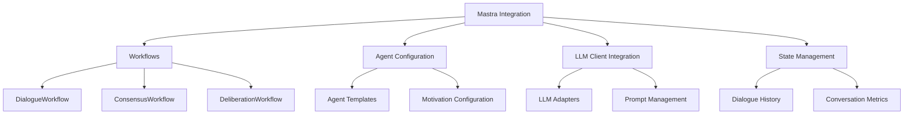

# Multi-Agent Dialogue Mastra Integration

## Purpose
This document details how the multi-agent dialogue system integrates with the Mastra AI framework.

## Classification
- **Domain:** System Integration
- **Stability:** Semi-stable
- **Abstraction:** Operational
- **Confidence:** High

## Content

### Overview

The multi-agent dialogue system is designed to integrate with Mastra, allowing for structured multi-agent conversations with complex interaction patterns. This integration leverages Mastra's workflow capabilities to orchestrate agent interactions, manage dialogue flows, and track conversation states.



### Core Components

#### 1. Mastra Workflows

The multi-agent dialogue system is exposed through Mastra workflows that encapsulate different dialogue patterns:

```typescript
// src/mastra/workflows/DialogueWorkflow.ts
export class DialogueWorkflow extends Workflow {
  constructor(
    private config: DialogueWorkflowConfig,
    private agents: AgentConfig[],
    private topic: string
  ) {
    super();
  }

  async execute(context: WorkflowContext): Promise<WorkflowResult> {
    // Initialize simulation
    const simulation = new DialogueSimulation({
      mode: this.config.mode,
      topic: this.topic,
      agents: await this.initializeAgents(this.agents, context)
    });

    // Set up event handlers
    this.setupEventHandlers(simulation, context);

    // Run the simulation
    const result = await simulation.run();

    // Process and return results
    return this.processResult(result, context);
  }

  private async initializeAgents(
    agentConfigs: AgentConfig[],
    context: WorkflowContext
  ): Promise<DialogueAgent[]> {
    // Convert agent configs to DialogueAgent instances
    return Promise.all(
      agentConfigs.map(async config => {
        const llmClient = await this.getLLMClient(config.llmConfig, context);
        return AgentFactory.createFromProfile(config, llmClient);
      })
    );
  }

  private async getLLMClient(
    llmConfig: LLMConfig,
    context: WorkflowContext
  ): Promise<ILLMClient> {
    // Get LLM client from Mastra or create a new one
    if (context.llmClients && context.llmClients[llmConfig.id]) {
      return context.llmClients[llmConfig.id];
    }
    
    return new LLMClientFactory().create(llmConfig);
  }

  private setupEventHandlers(
    simulation: DialogueSimulation,
    context: WorkflowContext
  ): void {
    simulation.on('turn', (turn: DialogueTurn) => {
      context.emit('dialogueTurn', turn);
    });

    simulation.on('modeTransition', (transition: ModeTransition) => {
      context.emit('modeTransition', transition);
    });

    // Other event handlers...
  }

  private processResult(
    result: SimulationResult,
    context: WorkflowContext
  ): WorkflowResult {
    return {
      outcome: result.outcome,
      dialogue: result.dialogue,
      metrics: result.metrics,
      summary: result.summary
    };
  }
}
```

#### 2. Specialized Workflows

Different dialogue patterns have specialized workflows:

```typescript
// src/mastra/workflows/ConsensusWorkflow.ts
export class ConsensusWorkflow extends DialogueWorkflow {
  constructor(
    private consensusConfig: ConsensusConfig,
    agents: AgentConfig[],
    topic: string
  ) {
    super(
      {
        mode: SimulationMode.CONSENSUS,
        exitConditions: [
          {
            type: 'consensus-reached',
            config: {
              agreementThreshold: consensusConfig.agreementThreshold || 0.85,
              lowBidThreshold: consensusConfig.lowBidThreshold || 0.2,
              requiredTurnsStable: consensusConfig.requiredTurnsStable || 3
            }
          }
        ]
      },
      agents,
      topic
    );
  }

  async execute(context: WorkflowContext): Promise<WorkflowResult> {
    // Add consensus-specific tracking
    context.set('consensusTracker', new ConsensusTracker());
    
    const result = await super.execute(context);
    
    // Add consensus analysis to result
    const consensusTracker = context.get('consensusTracker');
    return {
      ...result,
      consensus: {
        level: consensusTracker.getConsensusLevel(),
        points: consensusTracker.getConsensusPoints(),
        dissent: consensusTracker.getDissentPoints()
      }
    };
  }
}

// src/mastra/workflows/DeliberationWorkflow.ts
export class DeliberationWorkflow extends DialogueWorkflow {
  constructor(
    private deliberationConfig: DeliberationConfig,
    agents: AgentConfig[],
    topic: string
  ) {
    super(
      {
        mode: SimulationMode.DELIBERATIVE,
        exitConditions: [
          {
            type: 'topic-exhaustion',
            config: {
              topicCoverageThreshold: deliberationConfig.coverageThreshold || 0.8,
              diminishingReturnsThreshold: deliberationConfig.diminishingReturnsThreshold || 0.1
            }
          }
        ]
      },
      agents,
      topic
    );
  }

  async execute(context: WorkflowContext): Promise<WorkflowResult> {
    // Add deliberation-specific tracking
    context.set('topicTracker', new TopicEvolutionTracker());
    context.set('insightTracker', new InsightTracker());
    
    const result = await super.execute(context);
    
    // Add deliberation analysis to result
    return {
      ...result,
      deliberation: {
        topicCoverage: context.get('topicTracker').getCoverageMetrics(),
        insights: context.get('insightTracker').getInsights(),
        evidenceQuality: context.get('insightTracker').getEvidenceQualityMetrics()
      }
    };
  }
}
```

#### 3. Usage in Mastra

Integrating the multi-agent dialogue system into Mastra applications:

```typescript
// Example Mastra application using dialogue workflows
import { Mastra, Workflow } from 'mastra';
import { ConsensusWorkflow, DeliberationWorkflow } from './workflows';

export class MultiAgentDialogueApp {
  private mastra: Mastra;
  
  constructor(config: MastraConfig) {
    this.mastra = new Mastra(config);
    this.registerWorkflows();
  }
  
  private registerWorkflows(): void {
    this.mastra.registerWorkflow('consensus-dialogue', ConsensusWorkflow);
    this.mastra.registerWorkflow('deliberative-dialogue', DeliberationWorkflow);
    this.mastra.registerWorkflow('negotiation-dialogue', NegotiationWorkflow);
    // Register other workflows...
  }
  
  async runConsensusDialogue(
    topic: string,
    agents: AgentConfig[]
  ): Promise<DialogueResult> {
    return this.mastra.runWorkflow('consensus-dialogue', {
      consensusConfig: {
        agreementThreshold: 0.8,
        lowBidThreshold: 0.15,
        requiredTurnsStable: 3
      },
      agents,
      topic
    });
  }
  
  async runDeliberativeDialogue(
    topic: string,
    agents: AgentConfig[]
  ): Promise<DialogueResult> {
    return this.mastra.runWorkflow('deliberative-dialogue', {
      deliberationConfig: {
        coverageThreshold: 0.85,
        diminishingReturnsThreshold: 0.12
      },
      agents,
      topic
    });
  }
  
  // Other methods to run different dialogue types...
}
```

### Agent Integration

Dialogue agents are integrated with Mastra's agent system:

```typescript
// src/mastra/agents/DialogueAgentAdapter.ts
export class DialogueAgentAdapter implements MastraAgent {
  constructor(
    private dialogueAgent: DialogueAgent,
    private config: DialogueAgentAdapterConfig = {}
  ) {}
  
  async process(input: AgentInput, context: AgentContext): Promise<AgentOutput> {
    // Adapt input from Mastra format to DialogueAgent format
    const dialogueInput = this.adaptInput(input, context);
    
    // Process through dialogue agent
    const response = await this.dialogueAgent.generateResponse(dialogueInput);
    
    // Adapt output back to Mastra format
    return this.adaptOutput(response, context);
  }
  
  private adaptInput(input: AgentInput, context: AgentContext): DialogueInput {
    return {
      message: input.message,
      history: context.get('dialogueHistory') || [],
      context: {
        currentTopic: context.get('currentTopic'),
        agentRoles: context.get('agentRoles'),
        // Other context mapping...
      }
    };
  }
  
  private adaptOutput(response: DialogueResponse, context: AgentContext): AgentOutput {
    // Store dialogue history for future turns
    const history = context.get('dialogueHistory') || [];
    history.push({
      agentId: this.dialogueAgent.id,
      message: response.message,
      timestamp: Date.now()
    });
    context.set('dialogueHistory', history);
    
    return {
      message: response.message,
      confidence: response.confidence,
      metadata: {
        motivations: response.motivations,
        reasoning: response.reasoning,
        // Other metadata...
      }
    };
  }
}
```

### LLM Client Integration

The dialogue system integrates with LLM providers through Mastra's abstraction:

```typescript
// src/mastra/llm/LLMClientAdapter.ts
export class LLMClientAdapter implements ILLMClient {
  constructor(
    private mastraLLM: MastraLLM,
    private config: LLMClientAdapterConfig = {}
  ) {}
  
  async complete(prompt: string, options?: CompletionOptions): Promise<string> {
    // Convert to Mastra LLM request format
    const mastraRequest = {
      prompt,
      temperature: options?.temperature || 0.7,
      maxTokens: options?.maxTokens,
      stopSequences: options?.stopSequences,
      // Other parameter mapping...
    };
    
    // Use Mastra LLM client
    const response = await this.mastraLLM.complete(mastraRequest);
    
    // Return completion text
    return response.text;
  }
  
  async chatComplete(
    messages: ChatMessage[],
    options?: ChatCompletionOptions
  ): Promise<ChatMessage> {
    // Convert to Mastra chat format
    const mastraMessages = messages.map(msg => ({
      role: msg.role,
      content: msg.content
    }));
    
    // Use Mastra LLM client
    const response = await this.mastraLLM.chatComplete({
      messages: mastraMessages,
      temperature: options?.temperature || 0.7,
      maxTokens: options?.maxTokens,
      // Other parameter mapping...
    });
    
    // Return response message
    return {
      role: 'assistant',
      content: response.message.content
    };
  }
}
```

### Event Handling and Metrics

The dialogue system emits events that can be captured and processed by Mastra:

```typescript
// Example event handling in a Mastra application
mastra.on('dialogueTurn', (turn: DialogueTurn) => {
  console.log(`${turn.agent.name} says: ${turn.message}`);
  
  // Analyze turn for insights
  const sentiment = sentimentAnalyzer.analyze(turn.message);
  const topicRelevance = topicAnalyzer.calculateRelevance(turn.message, currentTopic);
  
  // Store metrics
  metrics.sentiment.push(sentiment);
  metrics.topicRelevance.push(topicRelevance);
  
  // Potentially trigger actions based on turn content
  if (sentiment.negativity > 0.8) {
    mediationSystem.activate();
  }
});

mastra.on('modeTransition', (transition: ModeTransition) => {
  console.log(`Transitioning from ${transition.from} to ${transition.to}`);
  console.log(`Reason: ${transition.reason}`);
  
  // Adapt UI or other systems to new mode
  if (transition.to === SimulationMode.CONSENSUS) {
    ui.activateConsensusVisualization();
  }
});

mastra.on('consensusUpdate', (update: ConsensusUpdate) => {
  console.log(`Consensus level: ${update.level}`);
  console.log(`Agreement points: ${update.points.join(', ')}`);
  
  // Update visualization
  consensusVisualizer.update(update);
});
```

### Configuration Management

Dialogue configuration can be managed through Mastra's configuration system:

```typescript
// Example configuration in a Mastra application
const config = {
  // Mastra core configuration
  llm: {
    provider: 'openrouter',
    apiKey: process.env.OPENROUTER_API_KEY,
    defaultModel: 'openai/gpt-4'
  },
  
  // Dialogue system configuration
  dialogue: {
    defaultMode: SimulationMode.CONSENSUS,
    agentTemplates: {
      facilitator: {
        systemPrompt: "You are a skilled facilitator...",
        motivations: [
          { type: 'consensus-seeking', weight: 0.8 },
          { type: 'process-improvement', weight: 0.2 }
        ]
      },
      expert: {
        systemPrompt: "You are a subject matter expert...",
        motivations: [
          { type: 'truth-seeking', weight: 0.6 },
          { type: 'teaching', weight: 0.4 }
        ]
      },
      advocate: {
        systemPrompt: "You represent stakeholders...",
        motivations: [
          { type: 'positional', weight: 0.7 },
          { type: 'value-maximization', weight: 0.3 }
        ]
      }
    },
    defaultExitConditions: {
      maxTurns: 50,
      idleTimeout: 300000 // 5 minutes
    }
  }
};

const mastra = new Mastra(config);
```

### Example Application

A complete example of a multi-agent dialogue application using Mastra:

```typescript
// Example: Stakeholder consensus application
import { Mastra } from 'mastra';
import { ConsensusWorkflow, AgentConfig, SimulationMode } from './dialogue';

async function main() {
  // Initialize Mastra
  const mastra = new Mastra({
    llm: {
      provider: 'openrouter',
      apiKey: process.env.OPENROUTER_API_KEY
    }
  });
  
  // Register workflows
  mastra.registerWorkflow('consensus-dialogue', ConsensusWorkflow);
  
  // Configure agents
  const agents: AgentConfig[] = [
    {
      name: "Community Representative",
      motivations: [
        { type: 'positional', weight: 0.6 },
        { type: 'consensus-seeking', weight: 0.4 }
      ],
      context: {
        representsGroup: "Local Neighborhood Association",
        keyInterests: [
          "preserving community character",
          "affordable housing",
          "pedestrian safety"
        ]
      }
    },
    {
      name: "Developer",
      motivations: [
        { type: 'value-maximization', weight: 0.7 },
        { type: 'relationship-preservation', weight: 0.3 }
      ],
      context: {
        profession: "Real Estate Developer",
        keyInterests: [
          "project approval",
          "reasonable timelines",
          "profitable development"
        ]
      }
    },
    {
      name: "City Planner",
      motivations: [
        { type: 'collaborative', weight: 0.5 },
        { type: 'truth-seeking', weight: 0.5 }
      ],
      context: {
        profession: "Urban Planner",
        expertise: ["zoning", "urban design", "public policy"],
        keyInterests: [
          "regulatory compliance",
          "sustainable development",
          "balanced growth"
        ]
      }
    }
  ];
  
  // Set up event handling
  mastra.on('dialogueTurn', (turn) => {
    console.log(`${turn.agent.name}: ${turn.message}`);
  });
  
  mastra.on('consensusUpdate', (update) => {
    console.log(`Consensus level: ${update.level.toFixed(2)}`);
    if (update.points.length > 0) {
      console.log(`Agreement points:`);
      update.points.forEach(point => console.log(`- ${point}`));
    }
  });
  
  // Run consensus dialogue
  const result = await mastra.runWorkflow('consensus-dialogue', {
    consensusConfig: {
      agreementThreshold: 0.75
    },
    agents,
    topic: "Mixed-use development proposal for Main Street"
  });
  
  // Process results
  console.log("\n=== DIALOGUE SUMMARY ===");
  console.log(result.summary);
  
  console.log("\n=== CONSENSUS ACHIEVED ===");
  result.consensus.points.forEach(point => {
    console.log(`- ${point}`);
  });
  
  if (result.consensus.dissent.length > 0) {
    console.log("\n=== REMAINING DISAGREEMENTS ===");
    result.consensus.dissent.forEach(point => {
      console.log(`- ${point}`);
    });
  }
}

main().catch(console.error);
```

## Relationships
- **Parent Nodes:** 
  - [elements/multi-agent-dialogue/architecture.md]
- **Child Nodes:** None
- **Related Nodes:** 
  - [elements/multi-agent-dialogue/simulation_modes.md] - modes implemented as workflows
  - [elements/deno/overview.md] - platform for implementation

## Navigation Guidance
- **Access Context:** Use this document to understand how multi-agent dialogue integrates with Mastra
- **Common Next Steps:** Review specific workflow implementations or Mastra configuration
- **Related Tasks:** Implementing new workflows, configuring Mastra integration
- **Update Patterns:** Update when adding new workflows or changing Mastra integration

## Metadata
- **Created:** 2025-05-31
- **Last Updated:** 2025-05-31
- **Updated By:** AI Assistant

## Change History
- 2025-05-31: Initial creation based on multi-agent-dialogue-system.md
