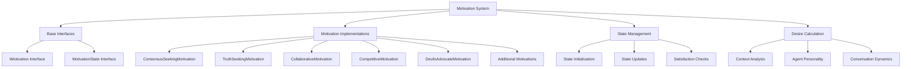

# Multi-Agent Dialogue Motivation System

## Purpose
This document details the motivation system that drives agent behaviors in the multi-agent dialogue system.

## Classification
- **Domain:** Agent Behavior
- **Stability:** Semi-stable
- **Abstraction:** Conceptual
- **Confidence:** High

## Content

### Overview

The motivation system is a core component of the multi-agent dialogue architecture that gives agents internal drives and desires. These motivations influence when agents want to speak and what they want to contribute to the conversation. The system provides a psychologically-inspired framework for creating more realistic and varied dialogue dynamics.



### Core Components

#### 1. Motivation Interface

The `IMotivation` interface defines the contract that all motivation implementations must follow:

```typescript
export interface IMotivation {
  id: string;
  name: string;
  
  // Calculate desire to speak (0-1 urgency value)
  calculateDesire(
    agent: IAgent,
    state: MotivationState,
    context: DialogueContext
  ): Promise<number>;
  
  // Update motivation state after a dialogue turn
  updateState(
    state: MotivationState,
    turn: DialogueTurn,
    context: DialogueContext
  ): MotivationState;
  
  // Check if motivation goals are satisfied
  isSatisfied(state: MotivationState): boolean;
}
```

#### 2. Motivation State

The `MotivationState` interface represents the internal state of a motivation:

```typescript
export interface MotivationState {
  satisfaction: number; // 0-1 scale
  urgency: number; // 0-1 scale
  agreement: Map<string, number>; // Agreement levels with other agents
  topicsAddressed: Set<string>;
  emotionalState: EmotionalState;
  metadata: Record<string, any>; // Flexible extension point
}
```

#### 3. MotivatedAgent Integration

The `MotivatedAgent` class extends `DialogueAgent` to incorporate motivations:

```typescript
export abstract class MotivatedAgent extends DialogueAgent {
  protected motivations: IMotivation[] = [];
  protected motivationStates: Map<string, MotivationState> = new Map();
  
  // Initialize motivations
  protected initializeMotivations(motivations: IMotivation[]) {
    this.motivations = motivations;
    
    // Create initial state for each motivation
    for (const motivation of motivations) {
      this.motivationStates.set(motivation.id, {
        satisfaction: 0.5, // Start neutral
        urgency: 0.5,
        agreement: new Map(),
        topicsAddressed: new Set(),
        emotionalState: { valence: 0, arousal: 0 },
        metadata: {}
      });
    }
  }
  
  // Calculate bid to speak based on motivations
  async calculateBid(context: BiddingContext): Promise<BidResult> {
    // Context influences bidding
    const contextModifier = this.calculateContextModifier(context);
    
    // Gather desires from all motivations
    const desires = await Promise.all(
      this.motivations.map(m => 
        m.calculateDesire(this, this.motivationStates.get(m.id)!, context)
      )
    );
    
    // Combine desires based on agent's personality
    const aggregatedDesire = this.aggregateDesires(desires) * contextModifier;
    
    return {
      value: aggregatedDesire,
      reasoning: this.explainBid(desires),
      motivationBreakdown: this.getMotivationBreakdown(desires),
      contextInfluence: this.explainContextInfluence(contextModifier)
    };
  }
  
  // Different agent types can implement different aggregation strategies
  protected abstract aggregateDesires(desires: number[]): number;
}
```

### Motivation Implementations

#### 1. ConsensusSeekingMotivation

Drives agents to work toward agreement and common ground:

```typescript
export class ConsensusSeekingMotivation implements IMotivation {
  id = 'consensus-seeking';
  name = 'Consensus Seeking';
  
  constructor(
    private config: ConsensusConfig = {
      targetAgreement: 0.8,
      compromiseWillingness: 0.7,
      patienceDecayRate: 0.05
    }
  ) {}

  async calculateDesire(
    agent: IAgent,
    state: MotivationState,
    context: DialogueContext
  ): Promise<number> {
    const disagreementLevel = await this.analyzeDisagreement(context);
    const recentCompromises = this.detectRecentCompromises(context);
    
    // High desire when disagreement exists but compromise is emerging
    if (disagreementLevel > 0.3 && recentCompromises > 0) {
      return Math.min(0.9, disagreementLevel + recentCompromises * 0.3);
    }
    
    // Low desire when consensus is near
    if (state.agreement.size > 0) {
      const avgAgreement = Array.from(state.agreement.values())
        .reduce((a, b) => a + b, 0) / state.agreement.size;
      
      if (avgAgreement > this.config.targetAgreement) {
        return 0.1; // Minimal desire to speak when consensus reached
      }
    }
    
    return 0.5; // Moderate desire otherwise
  }

  // Other implementation methods...
}
```

#### 2. TruthSeekingMotivation

Drives agents to uncover facts and seek evidence:

```typescript
export class TruthSeekingMotivation implements IMotivation {
  id = 'truth-seeking';
  name = 'Truth Seeking';
  
  constructor(
    private config: TruthSeekingConfig = {
      evidenceThreshold: 0.7,
      questioningRate: 0.6,
      clarificationUrgency: 0.8
    }
  ) {}

  async calculateDesire(
    agent: IAgent,
    state: MotivationState,
    context: DialogueContext
  ): Promise<number> {
    const unsubstantiatedClaims = await this.findUnsubstantiatedClaims(context);
    const contradictions = await this.detectContradictions(context);
    const ambiguities = await this.identifyAmbiguities(context);
    
    // High desire when truth is unclear
    const clarityNeed = (
      unsubstantiatedClaims * 0.4 +
      contradictions * 0.4 +
      ambiguities * 0.2
    );
    
    return Math.min(1, clarityNeed * this.config.clarificationUrgency);
  }

  // Other implementation methods...
}
```

#### 3. CollaborativeMotivation

Drives agents to build on others' ideas:

```typescript
export class CollaborativeMotivation implements IMotivation {
  id = 'collaborative';
  name = 'Collaborative';
  
  async calculateDesire(
    agent: IAgent,
    state: MotivationState,
    context: DialogueContext
  ): Promise<number> {
    const buildOpportunities = await this.findBuildingOpportunities(context);
    const supportNeeded = await this.identifySupportNeeds(context);
    
    // Desire to speak when can add value to others' ideas
    return Math.max(buildOpportunities, supportNeeded);
  }
  
  // Other implementation methods...
}
```

#### 4. CreativeExplorationMotivation

Drives agents to explore new ideas and concepts:

```typescript
export class CreativeExplorationMotivation implements IMotivation {
  id = 'creative-exploration';
  name = 'Creative Exploration';
  
  async calculateDesire(
    agent: IAgent,
    state: MotivationState,
    context: DialogueContext
  ): Promise<number> {
    const noveltySpace = await this.assessNoveltySpace(context);
    const recentCreativity = this.measureRecentCreativity(context);
    const inspirationLevel = await this.detectInspiration(context);
    
    // High desire when see opportunities for creative leaps
    return Math.min(1, noveltySpace * 0.4 + inspirationLevel * 0.6);
  }
  
  // Other implementation methods...
}
```

### Motivation Configuration and Composition

Agents can be configured with multiple motivations, each with a weight:

```typescript
// Example agent with multiple weighted motivations
const dialogueAgent = new ContextualAgent(
  "agent-1",
  "Balanced Discussant",
  llmClient,
  systemPrompt,
  [
    { motivation: new TruthSeekingMotivation(), weight: 0.6 },
    { motivation: new CollaborativeMotivation(), weight: 0.3 },
    { motivation: new CreativeExplorationMotivation(), weight: 0.1 }
  ],
  context
);
```

Different combinations of motivations create different agent personalities:

- **Facilitator**: High consensus-seeking + collaborative
- **Innovator**: High creative-exploration + low truth-seeking
- **Critic**: High truth-seeking + devil's advocate
- **Mediator**: High consensus-seeking + relationship-preservation

### State Management

Motivation states evolve throughout a dialogue:

1. **Initialization**: States are initialized with default or personality-specific values
2. **Update**: After each turn, each motivation updates its state based on the new turn
3. **Satisfaction**: Motivations track their own satisfaction levels
4. **Urgency**: As time passes without satisfaction, urgency can increase

### Context Analysis

Motivations analyze various aspects of dialogue context:

- **Content Analysis**: What's being discussed
- **Interaction Patterns**: How agents are interacting
- **Agreement/Disagreement**: Levels of consensus
- **Emotional Dynamics**: Sentiment and emotion in dialogue
- **Topic Coverage**: What's been addressed vs. what's missing

## Relationships
- **Parent Nodes:** 
  - [elements/multi-agent-dialogue/architecture.md]
- **Child Nodes:** None
- **Related Nodes:** 
  - [elements/multi-agent-dialogue/bidding_strategies.md] - uses motivations for bidding
  - [elements/multi-agent-dialogue/simulation_modes.md] - configures motivations for modes

## Navigation Guidance
- **Access Context:** Use this document to understand how agent motivations work in the dialogue system
- **Common Next Steps:** Explore bidding strategies or simulation modes to see how motivations affect dialogue
- **Related Tasks:** Implementing new motivation types, configuring agent personalities
- **Update Patterns:** Update when adding new motivation types or changing motivation behaviors

## Metadata
- **Created:** 2025-05-31
- **Last Updated:** 2025-05-31
- **Updated By:** AI Assistant

## Change History
- 2025-05-31: Initial creation based on multi-agent-dialogue-system.md
