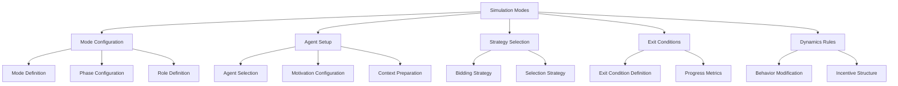

# Multi-Agent Dialogue Simulation Modes

## Purpose
This document details the various simulation modes that can be used to orchestrate different types of multi-agent dialogues.

## Classification
- **Domain:** Dialogue Control
- **Stability:** Semi-stable
- **Abstraction:** Operational
- **Confidence:** High

## Content

### Overview

Simulation modes define the overall character and objectives of a dialogue. Each mode configures agents, motivations, bidding strategies, and exit conditions to create specific dialogue experiences. Modes can range from competitive debates to collaborative problem-solving sessions, each with distinct dynamics and goals.



### Core Components

#### 1. Mode Definition

Simulation modes are defined by a consistent interface:

```typescript
export enum SimulationMode {
  COMPETITIVE = 'competitive',
  CONSENSUS = 'consensus',
  DELIBERATIVE = 'deliberative',
  EXPLORATORY = 'exploratory',
  ADAPTIVE = 'adaptive',
  DISCOVERY = 'discovery',
  PEDAGOGICAL = 'pedagogical',
  NEGOTIATION = 'negotiation',
  PROBLEM_SOLVING = 'problem_solving',
  NARRATIVE = 'narrative',
  INVESTIGATIVE = 'investigative',
  THERAPEUTIC = 'therapeutic',
  DEVILS_ADVOCATE = 'devils_advocate',
  FORECASTING = 'forecasting',
  MEDIATION = 'mediation',
  META_COGNITIVE = 'meta_cognitive'
}

export interface SimulationModeConfig {
  mode: SimulationMode;
  description: string;
  agents: AgentConfig[];
  dynamics: DynamicsConfig;
  exitConditions: ExitConditionConfig[];
  phases?: SimulationPhase[];
  roles?: Record<string, RoleConfig>;
  characteristics?: ModeCharacteristics;
}

export interface ModeCharacteristics {
  // Behavioral flags
  maintainNarrativeCoherence?: boolean;
  informationAsymmetry?: boolean;
  emotionalSafety?: boolean;
  constructiveConflict?: boolean;
  timeHorizonAware?: boolean;
  processAwareness?: boolean;
  
  // Bidding modifiers
  biddingBoost?: Record<string, number>;
  biddingPenalty?: Record<string, number>;
  
  // Interaction patterns
  turnPattern?: string;
  requireAcknowledgment?: boolean;
  allowPauses?: boolean;
  allowMetaProposals?: boolean;
}
```

#### 2. Simulation Modes Registry

The system includes a registry of predefined simulation modes:

```typescript
export const SimulationModes = {
  [SimulationMode.CONSENSUS]: {
    description: "Build agreement through collaborative discussion",
    defaultMotivations: [
      new ConsensusSeekingMotivation(),
      new CollaborativeMotivation()
    ],
    selectionStrategy: new ConsensusThresholdStrategy(),
    biddingStrategy: new ConsensusBidding(),
    exitConditions: [
      new ConsensusReachedCondition(),
      new LowEngagementCondition({ threshold: 0.15 })
    ],
    dynamics: {
      encourageAgreement: true,
      penalizePolarization: true,
      rewardCompromise: true
    }
  },
  
  // Other modes follow similar pattern
};
```

### Primary Simulation Modes

#### 1. Consensus Mode

Focused on building agreement through collaborative discussion:

```typescript
const consensusMode = {
  description: "Build agreement through collaborative discussion",
  defaultMotivations: [
    new ConsensusSeekingMotivation(),
    new CollaborativeMotivation()
  ],
  selectionStrategy: new ConsensusThresholdStrategy({
    speakingThreshold: 0.3,
    consensusTarget: 0.8,
    quietPeriodAfterAgreement: 2
  }),
  biddingStrategy: new ConsensusBidding(),
  exitConditions: [
    new ConsensusReachedCondition({
      agreementThreshold: 0.85,
      lowBidThreshold: 0.2,
      requiredTurnsStable: 3
    }),
    new LowEngagementCondition({ threshold: 0.15 })
  ],
  dynamics: {
    encourageAgreement: true,
    penalizePolarization: true,
    rewardCompromise: true
  }
};
```

Key characteristics:
- Focuses on finding common ground and agreement
- Discourages polarizing statements
- Ends when agents reach consensus
- Uses collaborative motivations

#### 2. Deliberative Mode

Explores topics deeply with focus on truth and understanding:

```typescript
const deliberativeMode = {
  description: "Explore topics deeply with focus on truth and understanding",
  defaultMotivations: [
    new TruthSeekingMotivation(),
    new CollaborativeMotivation()
  ],
  selectionStrategy: new MultiObjectiveStrategy({
    objectives: ['clarity', 'coverage', 'depth']
  }),
  biddingStrategy: new AdaptiveBidding({
    exploration: new ExplorationBidding(),
    deepening: new DeepeningBidding(),
    synthesis: new SynthesisBidding()
  }),
  exitConditions: [
    new TopicExhaustionCondition(),
    new InsightSaturationCondition()
  ],
  dynamics: {
    encouragePrecision: true,
    rewardEvidenceUse: true,
    penalizeVagueness: true
  }
};
```

Key characteristics:
- Focuses on depth and clarity
- Values evidence and precision
- Explores topics thoroughly
- Uses truth-seeking motivations

#### 3. Discovery Mode

Maximizes idea generation and creative exploration:

```typescript
const discoveryMode = {
  description: "Maximize idea generation and creative exploration",
  defaultMotivations: [
    new CreativeExplorationMotivation(),
    new AssociativeThinkingMotivation(),
    new YesAndMotivation()
  ],
  selectionStrategy: new DiversityPromotingStrategy(),
  biddingStrategy: new CreativityBoostedBidding(),
  exitConditions: [
    new IdeaSaturationCondition(),
    new EnergyDepletionCondition()
  ],
  characteristics: {
    biddingBoost: {
      newIdeas: 2.0,
      tangentialThoughts: 1.5,
      "yes-and": 1.8
    },
    biddingPenalty: {
      criticism: 0.3,
      repetition: 0.1,
      prematureConvergence: 0.4
    }
  },
  dynamics: {
    deferJudgment: true,
    encourageWildIdeas: true,
    buildOnIdeas: true
  }
};
```

Key characteristics:
- Maximizes idea quantity
- Discourages early criticism
- Rewards building on others' ideas
- Uses creative and associative motivations

#### 4. Pedagogical Mode

Optimizes for knowledge transfer and understanding:

```typescript
const pedagogicalMode = {
  description: "Optimize for knowledge transfer and understanding",
  roles: {
    teacher: {
      motivations: [new ScaffoldingMotivation(), new ClarityMotivation()],
      biddingModifier: 1.2
    },
    learner: {
      motivations: [new CuriosityMotivation(), new UnderstandingMotivation()],
      biddingModifier: 1.0
    }
  },
  selectionStrategy: new RoleAwareSelection(),
  biddingStrategy: new TurnTakingBidding(),
  exitConditions: [
    new UnderstandingAchievedCondition(),
    new LearningObjectivesMetCondition()
  ],
  characteristics: {
    biddingBoost: {
      clarificationQuestions: 1.5,
      examples: 1.3,
      corrections: 1.8
    }
  },
  dynamics: {
    encourageQuestions: true,
    provideScaffolding: true,
    checkUnderstanding: true
  }
};
```

Key characteristics:
- Teacher and learner roles
- Encourages questions and clarifications
- Checks understanding regularly
- Uses scaffolding and clarity motivations

#### 5. Negotiation Mode

Finds mutually beneficial agreements from different positions:

```typescript
const negotiationMode = {
  description: "Find mutually beneficial agreements from different positions",
  defaultMotivations: [
    new PositionalMotivation(),
    new ValueMaximizationMotivation(),
    new RelationshipPreservationMotivation()
  ],
  selectionStrategy: new AlternatingSelectionStrategy(),
  biddingStrategy: new NegotiationBidding(),
  exitConditions: [
    new DealReachedCondition(),
    new ImpasseCondition(),
    new BATNATriggeredCondition()
  ],
  characteristics: {
    maintainPositions: true,
    allowConcessions: true,
    trackValueExchange: true
  },
  dynamics: {
    separatePositionsFromInterests: true,
    focusOnMutualGain: true,
    useObjectiveCriteria: true
  }
};
```

Key characteristics:
- Tracks positions and interests
- Focuses on mutual gains
- Monitors concessions and value exchange
- Uses positional and value maximization motivations

#### 6. Problem Solving Mode

Collaborative work toward concrete solutions:

```typescript
const problemSolvingMode = {
  description: "Collaborative work toward concrete solutions",
  defaultMotivations: [
    new SolutionOrientedMotivation(),
    new ConstraintAwarenessMotivation(),
    new PracticalityMotivation()
  ],
  selectionStrategy: new PhaseAwareSelection(),
  biddingStrategy: new PhaseAwareBidding(),
  exitConditions: [
    new ViableSolutionFoundCondition(),
    new AllConstraintsSatisfiedCondition()
  ],
  phases: [
    { name: "problem-definition", duration: 5 },
    { name: "constraint-identification", duration: 3 },
    { name: "solution-generation", duration: 8 },
    { name: "evaluation", duration: 4 },
    { name: "refinement", duration: 5 }
  ],
  dynamics: {
    trackConstraints: true,
    evaluateSolutions: true,
    measureProgress: true
  }
};
```

Key characteristics:
- Structured phases
- Emphasizes constraints and viability
- Evaluates solutions against criteria
- Uses solution-oriented motivations

#### 7. Devils Advocate Mode

Systematically challenges assumptions and ideas:

```typescript
const devilsAdvocateMode = {
  description: "Systematic challenge of assumptions and ideas",
  defaultMotivations: [
    new AssumptionChallengingMotivation(),
    new RobustnessTestingMotivation(),
    new BlindSpotIlluminationMotivation()
  ],
  selectionStrategy: new ChallengeResponseSelection(),
  biddingStrategy: new AsymmetricBidding(),
  exitConditions: [
    new RobustnessAchievedCondition(),
    new IdeaStrengthenedCondition()
  ],
  characteristics: {
    constructiveConflict: true,
    assumptionChallenging: true,
    steelManArguments: true,
    turnPattern: "challenge-defend-refine"
  },
  dynamics: {
    encourageCriticalThinking: true,
    preventGroupthink: true,
    strengthenArguments: true
  }
};
```

Key characteristics:
- Structured challenge-defend-refine pattern
- Emphasizes constructive conflict
- Steel-mans arguments before challenging
- Uses assumption-challenging motivations

#### 8. Adaptive Mode

Dynamically shifts between modes based on conversation needs:

```typescript
const adaptiveMode = {
  description: "Dynamically shifts between modes based on conversation needs",
  modeSelector: new DynamicModeSelector(),
  selectionStrategy: new AdaptiveSelection(),
  biddingStrategy: new AdaptiveBidding({}),
  exitConditions: [
    new CompositeCondition([])
  ],
  transitionRules: [
    {
      from: SimulationMode.COMPETITIVE,
      to: SimulationMode.CONSENSUS,
      condition: (metrics) => metrics.polarization > 0.8
    },
    {
      from: SimulationMode.CONSENSUS,
      to: SimulationMode.EXPLORATORY,
      condition: (metrics) => metrics.agreement > 0.9 && metrics.topicCoverage < 0.5
    },
    {
      from: SimulationMode.DISCOVERY,
      to: SimulationMode.PROBLEM_SOLVING,
      condition: (metrics) => metrics.ideaSaturation > 0.7
    },
    {
      from: SimulationMode.PROBLEM_SOLVING,
      to: SimulationMode.DEVILS_ADVOCATE,
      condition: (metrics) => metrics.solutionConfidence > 0.6 && !metrics.robustnessTested
    }
  ],
  dynamics: {
    analyzeConversationState: true,
    adaptToEmergingNeeds: true,
    trackModeEffectiveness: true
  }
};
```

Key characteristics:
- Monitors conversation state
- Shifts modes based on needs
- Uses transition rules to determine shifts
- Adapts strategies dynamically

### Advanced Configuration: Multi-Phase Workflows

Some complex dialogue sessions can use multiple modes in sequence:

```typescript
// Complex Multi-Phase Innovation Process
export const innovationPipeline = {
  type: 'sequential',
  phases: [
    {
      name: 'Problem Discovery',
      mode: SimulationMode.INVESTIGATIVE,
      duration: 8,
      exitConditions: [{ type: 'problem-clarity', threshold: 0.8 }],
      carryForward: ['problem-statements', 'constraints']
    },
    {
      name: 'Ideation',
      mode: SimulationMode.DISCOVERY,
      duration: 12,
      config: {
        constraints: 'inherit', // From previous phase
        wildnessLevel: 0.9
      }
    },
    {
      name: 'Critical Analysis',
      mode: SimulationMode.DEVILS_ADVOCATE,
      duration: 6,
      config: {
        targetIdeas: 'top-10', // From previous phase
        rigor: 'high'
      }
    },
    {
      name: 'Solution Development',
      mode: SimulationMode.PROBLEM_SOLVING,
      duration: 10,
      config: {
        startingPoint: 'survived-ideas' // From critical analysis
      }
    },
    {
      name: 'Implementation Planning',
      mode: SimulationMode.FORECASTING,
      duration: 8,
      config: {
        timeHorizon: '5-years',
        scenarios: ['optimistic', 'realistic', 'pessimistic']
      }
    }
  ]
};
```

### Agent Behavior Modification

Simulation modes can modify agent behavior through:

1. **Motivation Weight Adjustment**
   - Increase/decrease weights of specific motivations

2. **Bidding Modifiers**
   - Boost/penalize certain types of contributions

3. **Turn Pattern Enforcement**
   - Structure dialogue with specific patterns

4. **Behavioral Flags**
   - Enable/disable specific agent behaviors

### Example Usage

```typescript
// examples/stakeholder-dialogue.ts
async function runStakeholderDialogue() {
  const simulation = new DialogueSimulation({
    mode: SimulationMode.NEGOTIATION,
    topic: "City planning for new public transit system",
    agents: [
      {
        name: "Sarah Chen",
        motivations: [
          { type: 'positional', weight: 0.6 },
          { type: 'value-maximization', weight: 0.4 }
        ],
        context: {
          profession: "Small Business Owner",
          expertise: ["retail", "customer service", "local economy"],
          representsGroup: "Downtown Business Association",
          constituencySize: 450,
          keyInterests: [
            "maintaining customer access during construction",
            "ensuring stops near business districts",
            "minimizing disruption to deliveries"
          ]
        }
      },
      {
        name: "Marcus Thompson",
        motivations: [
          { type: 'truth-seeking', weight: 0.5 },
          { type: 'consensus-seeking', weight: 0.5 }
        ],
        context: {
          profession: "Environmental Scientist",
          expertise: ["climate science", "urban sustainability", "public health"],
          representsGroup: "Green Cities Coalition",
          constituencySize: 12000,
          keyInterests: [
            "reducing carbon emissions",
            "improving air quality",
            "creating green corridors"
          ]
        }
      },
      {
        name: "Rita Patel",
        motivations: [
          { type: 'collaborative', weight: 0.7 },
          { type: 'relationship-preservation', weight: 0.3 }
        ],
        context: {
          profession: "City Council Member",
          expertise: ["public policy", "budget management", "community engagement"],
          yearsOfExperience: 12,
          currentChallenges: [
            "balancing competing interests",
            "working within budget constraints",
            "upcoming re-election"
          ]
        }
      }
    ]
  });

  return simulation.run();
}
```

### Customizing Simulation Modes

Custom simulation modes can be created by implementing the necessary components:

```typescript
// Custom simulation mode for creative writing
const creativeWritingMode = {
  description: "Collaborative story creation with consistent narrative",
  defaultMotivations: [
    new NarrativeCoherenceMotivation(),
    new CreativeExplorationMotivation(),
    new CharacterDevelopmentMotivation()
  ],
  selectionStrategy: new NarrativeTurnTaking({
    balanceCharacterVoices: true,
    tensionCurve: "rising-action"
  }),
  biddingStrategy: new NarrativeBidding(),
  exitConditions: [
    new StoryCompleteCondition(),
    new NarrativeArcCompletedCondition()
  ],
  characteristics: {
    maintainNarrativeCoherence: true,
    encourageCreativeBuilding: true,
    trackStoryElements: true
  },
  dynamics: {
    trackCharacters: true,
    buildTension: true,
    maintainConsistency: true
  }
};
```

## Relationships
- **Parent Nodes:** 
  - [elements/multi-agent-dialogue/architecture.md]
- **Child Nodes:** None
- **Related Nodes:** 
  - [elements/multi-agent-dialogue/motivation_system.md] - provides motivations for modes
  - [elements/multi-agent-dialogue/bidding_strategies.md] - provides bidding strategies for modes
  - [elements/multi-agent-dialogue/mastra_integration.md] - implements modes as workflows

## Navigation Guidance
- **Access Context:** Use this document to understand the different dialogue modes available
- **Common Next Steps:** Explore specific mode implementations or mastra integration
- **Related Tasks:** Configuring simulation modes, creating custom modes
- **Update Patterns:** Update when adding new modes or modifying existing ones

## Metadata
- **Created:** 2025-05-31
- **Last Updated:** 2025-05-31
- **Updated By:** AI Assistant

## Change History
- 2025-05-31: Initial creation based on multi-agent-dialogue-system.md
