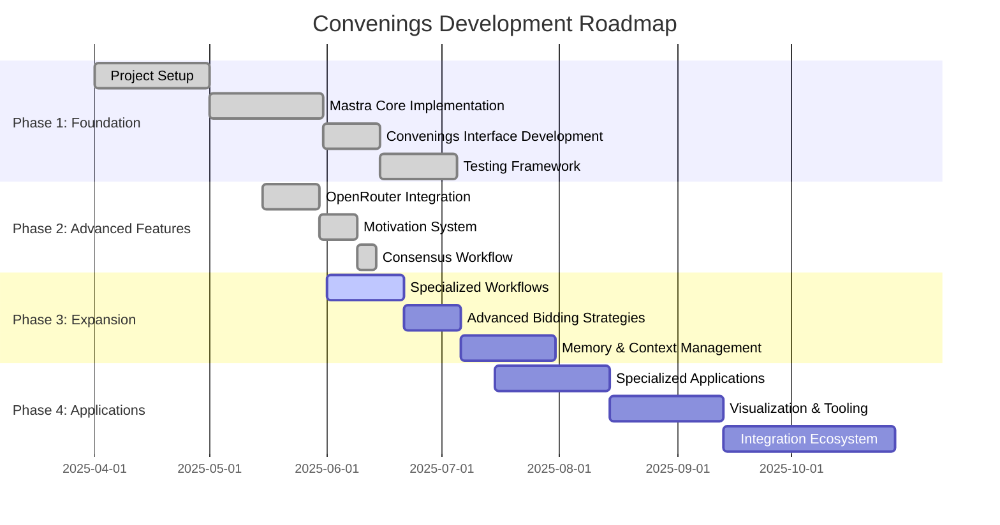

# Convenings Project Roadmap

## Purpose
This document outlines the planned development path for the Convenings project, including key milestones, features, and prioritized work items.

## Classification
- **Domain:** Planning
- **Stability:** Dynamic
- **Abstraction:** Structural
- **Confidence:** Evolving

## Content

### Roadmap Overview

The Convenings project aims to build a powerful multi-agent dialogue framework that enables sophisticated conversational interactions between multiple AI agents with different roles, motivations, and behaviors. With the recent completion of the OpenRouter integration and motivation system, the project is poised to expand in functionality, usability, and application domains.

### Current Phase

**Phase: Phase 3 - Expansion**
**Status: In Progress**

The project has successfully completed Phases 1 and 2, establishing the core framework and implementing advanced features like the OpenRouter integration, motivation system, and consensus workflow. Phase 3 focuses on expanding the capabilities of the framework with specialized workflows, advanced bidding strategies, and improved context management.

### Upcoming Milestones

#### Specialized Workflows
- **Target Date:** June 20, 2025
- **Status:** Not Started
- **Description:** Implement specialized dialogue workflows beyond the current dialogue and consensus workflows
- **Key Deliverables:**
  - Debate Workflow: Structured format for presenting opposing viewpoints
  - Brainstorming Workflow: Optimized for idea generation and exploration
  - Educational Workflow: Designed for tutoring and knowledge transfer
  - Meeting Workflow: Structured agenda-based discussions with action items
- **Dependencies:**
  - Existing dialogue and consensus workflows
  - Motivated participant implementation

#### Advanced Bidding Strategies
- **Target Date:** July 5, 2025
- **Status:** Not Started
- **Description:** Enhance the bidding system for more sophisticated turn-taking dynamics
- **Key Deliverables:**
  - Contextual Bidding: Bids based on dialogue context and relevance
  - Emotion-Based Bidding: Bidding influenced by simulated emotional states
  - Coalition Bidding: Allowing participants to form temporary alliances
  - Interruption Mechanics: Allow high-urgency participants to interrupt
- **Dependencies:**
  - Existing bidding implementation
  - Motivation system

#### Memory & Context Management
- **Target Date:** July 30, 2025
- **Status:** Not Started
- **Description:** Improve how participants maintain and utilize context throughout dialogues
- **Key Deliverables:**
  - Long-Term Memory: Persistent memory across dialogue turns
  - Reference Resolution: Better handling of references to previous statements
  - Belief Modeling: Track and update participant beliefs
  - Document Grounding: Connect dialogue to external documents/sources
- **Dependencies:**
  - Motivation system
  - Agent implementation

### Feature Timeline

#### Phase 3: Expansion (June 2025 - July 2025)
- **Timeline:** June 1, 2025 - July 30, 2025
- **Theme:** Expand capabilities and refine existing features
- **Features:**
  - Specialized Workflows: Implement debate, brainstorming, educational, and meeting workflows - Priority: High
  - Advanced Bidding Strategies: Develop contextual, emotion-based, coalition, and interruption bidding - Priority: Medium
  - Memory & Context Management: Implement long-term memory, reference resolution, belief modeling - Priority: High
  - Improved Consensus Detection: Enhance NLP-based consensus identification - Priority: Medium
  - Configuration API: Create a more flexible configuration system - Priority: Low

#### Phase 4: Applications (July 2025 - September 2025)
- **Timeline:** July 15, 2025 - September 30, 2025
- **Theme:** Build practical applications and improve usability
- **Features:**
  - Dialogue Visualization: Create tools to visualize dialogue flows - Priority: Medium
  - Web Interface: Build a simple web interface for creating and monitoring dialogues - Priority: High
  - CLI Tool: Develop a command-line tool for quick dialogue creation - Priority: Medium
  - Specialized Applications: Create domain-specific applications (education, decision support) - Priority: High
  - Integration Ecosystem: Build connectors for popular platforms - Priority: Medium

#### Phase 5: Ecosystem (October 2025 - December 2025)
- **Timeline:** October 1, 2025 - December 31, 2025
- **Theme:** Build an ecosystem around the core framework
- **Features:**
  - Plugin System: Create a plugin architecture for extensions - Priority: High
  - Community Templates: Develop shareable templates for common use cases - Priority: Medium
  - Performance Optimization: Enhance efficiency and reduce token usage - Priority: High
  - Multi-modal Support: Add support for image and audio inputs/outputs - Priority: Medium
  - Documentation and Examples: Comprehensive documentation and examples - Priority: High

### Immediate Action Items

1. **Implement Debate Workflow**
   - Structured format for two or more participants with opposing viewpoints
   - Turn-taking with opening statements, rebuttals, and conclusions
   - Scoring mechanism for argument quality and persuasiveness

2. **Enhance Bidding Strategies**
   - Implement contextual relevance scoring in bidding algorithm
   - Create emotion-influenced bidding based on dialogue context
   - Add ability for participants to form temporary coalitions

3. **Improve Dialogue Memory**
   - Implement a more robust memory system for participants
   - Add mechanisms for referencing and updating previous statements
   - Create a belief tracking system to model participant understanding

4. **Develop Configuration API**
   - Create a more flexible and extensible configuration system
   - Implement validation for configuration options
   - Add presets for common dialogue scenarios

5. **Create Visualization Tools**
   - Develop tools to visualize dialogue structures
   - Create dashboards for monitoring dialogue metrics
   - Implement exportable reports for dialogue analysis

### Risk Assessment

| Risk | Impact | Likelihood | Mitigation Strategy |
|------|--------|------------|---------------------|
| LLM API Changes | High | Medium | Design adapter layer for API changes, maintain multiple provider support |
| Performance Bottlenecks | Medium | High | Implement caching, parallel processing, and optimization techniques |
| Token Usage Costs | High | High | Develop strategies for efficient prompt engineering and context compression |
| Complex Configuration | Medium | Medium | Create sensible defaults, validation, and simplified helper functions |
| Integration Challenges | Medium | Medium | Develop comprehensive testing for integrations, provide adapters |

### Roadmap Review Process

This roadmap will be reviewed at the end of each milestone completion and updated quarterly or when significant changes in direction are required. The review process will include:

1. Assessment of completed features against planned deliverables
2. Evaluation of user feedback and usage patterns
3. Analysis of technical challenges and opportunities
4. Adjustment of priorities based on project goals and constraints
5. Update of timelines and deliverables for upcoming milestones

## Relationships
- **Parent Nodes:** [foundation/project_definition.md] - is-child-of - Implements the project vision
- **Child Nodes:** [planning/milestones.md] - details - Specific milestone information
- **Related Nodes:** 
  - [foundation/structure.md] - implements - Structure supports roadmap features
  - [elements/multi-agent-dialogue/architecture.md] - guides - Architecture informs roadmap development
  - [planning/testing_quality_improvement_plan.md] - supports - Testing plan ensures roadmap quality

## Navigation Guidance
- **Access Context:** Use this document when planning work, prioritizing features, or communicating development timeline
- **Common Next Steps:** After reviewing the roadmap, typically explore specific milestone details or related architecture documentation
- **Related Tasks:** Sprint planning, resource allocation, feature prioritization
- **Update Patterns:** This document should be updated quarterly or when significant changes to the project direction occur

## Metadata
- **Created:** 2025-05-31
- **Last Updated:** 2025-05-31
- **Updated By:** Cline

## Change History
- 2025-05-31: Initial creation of comprehensive roadmap based on current project state and future directions
