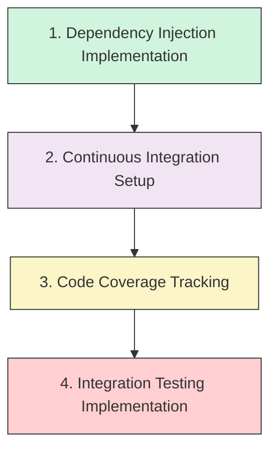

# Testing and Quality Improvement Plan

## Purpose
This document outlines the sequence of tasks needed to enhance the project's testing infrastructure, quality assurance processes, and development workflow. It provides a clear progression of implementation steps without specific timeline commitments.

## Classification
- **Domain:** Testing, Quality Assurance
- **Stability:** Semi-stable
- **Abstraction:** Structural
- **Confidence:** Evolving

## Content

### Overview

This plan focuses on enhancing the project's quality assurance infrastructure through a sequence of improvements to our testing approach, continuous integration capabilities, and development practices. The goal is to ensure more reliable code, better test coverage, and smoother integration processes.

The improvements are arranged in a logical sequence, with each step building upon previous accomplishments. This document is designed to make it clear what the next action should be at any given point in the implementation process.

### Task Sequence

#### 1. Dependency Injection Pattern Implementation

**Purpose:** Improve code testability by decoupling component dependencies, making it easier to substitute mock implementations during testing.

**Action Tasks:**
1. Research appropriate dependency injection patterns for Deno/TypeScript projects
2. Create a design document outlining the selected DI approach
3. Implement core DI container/framework
4. Refactor existing components to use the DI pattern
5. Update unit tests to leverage the new DI capabilities
6. Document the DI pattern usage for future development

**Planning Tasks:**
1. Evaluate different DI approaches (service locator, constructor injection, etc.)
2. Identify components that would benefit most from DI refactoring
3. Establish guidelines for when and how to use DI in the codebase

**Completion Criteria:**
- Core components use DI pattern for their dependencies
- Unit tests demonstrate the ability to inject mock dependencies
- Documentation explains the DI implementation and usage patterns
- Development guidelines updated to include DI best practices

**Context Network Updates:**
- Add dependency injection design document to `elements/deno/architecture.md`
- Update `decisions/` with a decision record explaining the DI pattern choice
- Document testing improvements in `elements/deno/testing.md`

#### 2. Continuous Integration Pipeline Setup

**Purpose:** Automate testing and quality checks to catch issues early in the development process.

**Action Tasks:**
1. Select CI platform (GitHub Actions, CircleCI, etc.)
2. Create initial CI configuration file
3. Set up automated unit test execution
4. Configure linting and type checking in the pipeline
5. Implement build verification steps
6. Set up notifications for CI results

**Planning Tasks:**
1. Evaluate CI platform options based on project needs
2. Design the CI workflow stages
3. Determine appropriate triggers for CI execution (PR, push, scheduled)

**Completion Criteria:**
- CI pipeline successfully runs on code changes
- Unit tests execute automatically
- Code quality checks (linting, type checking) run in the pipeline
- Team members receive notifications about pipeline results

**Context Network Updates:**
- Add CI configuration documentation to `processes/validation.md`
- Create workflow diagrams in `elements/deno/development_workflow.md`
- Update `foundation/principles.md` with CI/CD principles

#### 3. Code Coverage Tracking Implementation

**Purpose:** Identify untested code paths to prioritize future testing efforts and improve overall code quality.

**Action Tasks:**
1. Research code coverage tools compatible with Deno
2. Implement code coverage measurement in local test runs
3. Integrate coverage reporting into the CI pipeline
4. Set up coverage visualization/reporting
5. Establish coverage thresholds for critical components

**Planning Tasks:**
1. Determine appropriate coverage metrics (line, branch, function)
2. Establish realistic coverage goals for different parts of the codebase
3. Plan strategy for gradually increasing coverage requirements

**Completion Criteria:**
- Code coverage reporting works in local development
- Coverage reports generated automatically in CI pipeline
- Coverage visualization available to all team members
- Coverage thresholds enforced for critical code paths

**Context Network Updates:**
- Add coverage goals and metrics to `elements/deno/testing.md`
- Update CI documentation in `processes/validation.md`
- Document coverage requirements in `foundation/principles.md`

#### 4. Integration Testing Implementation

**Purpose:** Verify that components work correctly together by testing multiple components as a unified system.

**Action Tasks:**
1. Design integration test framework/approach
2. Create initial integration test suite
3. Implement test fixtures for common integration scenarios
4. Add integration tests to CI pipeline
5. Document integration testing patterns and practices

**Planning Tasks:**
1. Identify critical component interactions that need integration testing
2. Determine appropriate test environment setup (mocks vs. real dependencies)
3. Plan integration test organization and structure

**Completion Criteria:**
- Integration test framework/approach implemented
- Key component interactions covered by integration tests
- Integration tests run in CI pipeline
- Documentation explains integration testing approach

**Context Network Updates:**
- Add integration testing documentation to `elements/deno/testing.md`
- Update `processes/validation.md` with integration testing workflow
- Document integration test patterns in `decisions/` directory

### Progress Tracking

This table will be updated as tasks are completed:

| Task | Status | Progress | Next Action Item | Notes |
|------|--------|----------|------------------|-------|
| 1. Dependency Injection | Not Started | 0% | Research DI patterns for Deno | |
| 2. CI Pipeline | Not Started | 0% | Evaluate CI platforms | Depends on Task 1 |
| 3. Code Coverage | Not Started | 0% | Research coverage tools | Depends on Task 2 |
| 4. Integration Testing | Not Started | 0% | Design test approach | Depends on Task 3 |

### Implementation Notes

#### Dependency Injection Considerations
- Consider existing patterns in the Deno ecosystem
- Balance flexibility with simplicity
- Ensure compatibility with Deno's module system
- Minimize runtime overhead

#### CI Pipeline Considerations
- Optimize for fast feedback cycles
- Consider caching strategies for dependencies
- Balance comprehensiveness with execution time
- Ensure security of sensitive information

#### Code Coverage Considerations
- Focus on meaningful coverage rather than arbitrary percentages
- Consider both unit and integration test coverage
- Document intentionally uncovered code with explanations
- Integrate coverage visualization into development workflow

#### Integration Testing Considerations
- Design for stability and deterministic results
- Consider resource initialization and cleanup
- Balance test isolation with realistic interactions
- Document expected component behaviors

## Relationships
- **Parent Nodes:** 
  - [planning/roadmap.md] - is-child-of - This plan implements part of the overall roadmap
- **Child Nodes:** None yet
- **Related Nodes:** 
  - [elements/deno/testing.md] - implements - Enhances the testing approach
  - [processes/validation.md] - enhances - Improves validation processes
  - [foundation/principles.md] - supports - Aligns with quality principles

## Navigation Guidance
- **Access Context:** Use this document when planning development work related to testing and quality assurance
- **Common Next Steps:** Check the Progress Tracking table to identify the next task to implement
- **Related Tasks:** Test writing, CI configuration, quality improvement initiatives
- **Update Patterns:** Update this document after completing each major task to reflect progress

## Metadata
- **Created:** 2025-05-31
- **Last Updated:** 2025-05-31
- **Updated By:** AI Assistant

## Change History
- 2025-05-31: Initial creation based on testing improvement requirements
