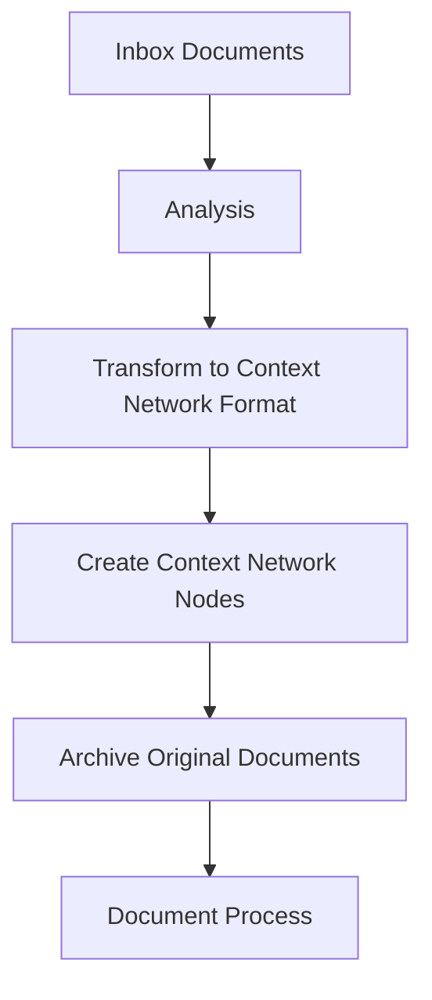

# Document Integration Record

## Purpose
This document records the process of integrating documents from the inbox into the context network, including how they were processed, transformed, and archived.

## Classification
- **Domain:** Process Documentation
- **Stability:** Stable
- **Abstraction:** Implementation
- **Confidence:** High

## Content

### Overview

This record documents the integration of design documents and wiki content from the `/inbox` directory into the context network. The documents were analyzed, transformed into structured context network nodes, and then archived to maintain a clean workspace.

### Documents Processed

#### 1. Multi-Agent Dialogue System Design Document
- **Original Location**: `/inbox/multi-agent-dialogue-system.md`
- **Content Type**: System architecture and design specification
- **Processing Date**: 2025-05-31

#### 2. Mastra Wiki Document
- **Original Location**: `/inbox/mastra_wiki.md`
- **Content Type**: Framework documentation and API reference
- **Processing Date**: 2025-05-31

### Integration Process

#### Step 1: Analysis of Source Documents

The source documents were analyzed to understand their structure, content, and relevance to the project. Key components identified:

1. **Multi-Agent Dialogue System**:
   - Core architecture concepts including motivation system, bidding strategies, and simulation modes
   - Component relationships and interactions
   - Code examples demonstrating implementations
   - Use cases and examples

2. **Mastra Wiki**:
   - Architecture overview of the Mastra framework
   - Documentation on agents, tools, workflows, and integrations
   - RAG implementation details
   - Deployment and configuration guides

#### Step 2: Transformation to Context Network Nodes

The content was restructured into multiple context network nodes following the context network template format. Each node was created with:

- Clear purpose statement
- Classification metadata
- Structured content with diagrams
- Relationship links to other nodes
- Navigation guidance
- Proper metadata including creation date

#### Step 3: Node Creation

The following context network nodes were created based on the source documents:

1. **From Multi-Agent Dialogue System Document**:
   - `context-network/elements/multi-agent-dialogue/architecture.md` - Overview of the system architecture
   - `context-network/elements/multi-agent-dialogue/motivation_system.md` - Details of the agent motivation system
   - `context-network/elements/multi-agent-dialogue/bidding_strategies.md` - Explanation of bidding mechanisms
   - `context-network/elements/multi-agent-dialogue/simulation_modes.md` - Documentation of different simulation modes
   - `context-network/elements/multi-agent-dialogue/mastra_integration.md` - Integration with Mastra framework

2. **From Mastra Wiki Document**:
   - `context-network/elements/mastra/openrouter_integration.md` - Guide for integrating OpenRouter as an LLM provider

#### Step 4: Archiving

After successful integration into the context network, the original documents were preserved in their original format in the appropriate archive location:

1. Source documents were moved to:
   - `inbox/archive/multi-agent-dialogue-system.md`
   - `inbox/archive/mastra_wiki.md`

2. The move was performed using appropriate archiving commands to maintain document history.

#### Step 5: Verification

Each created node was verified for:

- Completeness of content
- Proper formatting
- Accurate cross-references
- Consistency with context network standards

#### Step 6: Documentation

This process document was created to record the integration process, serving as a reference for future document integrations.

### Challenges and Solutions

1. **Challenge**: Maintaining relationships between fragmented content
   **Solution**: Created explicit relationship sections in each document with links to related nodes

2. **Challenge**: Determining appropriate granularity for node creation
   **Solution**: Used logical component boundaries from the original architecture to guide node separation

3. **Challenge**: Ensuring consistency across newly created nodes
   **Solution**: Established common section structure and cross-referenced between related nodes

### Next Steps

1. Continue integrating additional documents as they arrive in the inbox
2. Update cross-references as the context network evolves
3. Consider creating additional nodes for detailed implementation aspects as development progresses

## Relationships
- **Parent Nodes:** 
  - [processes/document_integration.md]
- **Child Nodes:** None
- **Related Nodes:** 
  - [elements/multi-agent-dialogue/architecture.md]
  - [elements/multi-agent-dialogue/motivation_system.md]
  - [elements/multi-agent-dialogue/bidding_strategies.md]
  - [elements/multi-agent-dialogue/simulation_modes.md]
  - [elements/multi-agent-dialogue/mastra_integration.md]
  - [elements/mastra/openrouter_integration.md]

## Navigation Guidance
- **Access Context:** Use this document to understand how documents were integrated into the context network
- **Common Next Steps:** Review the created nodes to understand the system architecture
- **Related Tasks:** Document integration, context network maintenance
- **Update Patterns:** Update when new documents are integrated into the context network

## Metadata
- **Created:** 2025-05-31
- **Last Updated:** 2025-05-31
- **Updated By:** AI Assistant

## Change History
- 2025-05-31: Initial creation documenting the integration of multi-agent dialogue system and Mastra wiki documents
