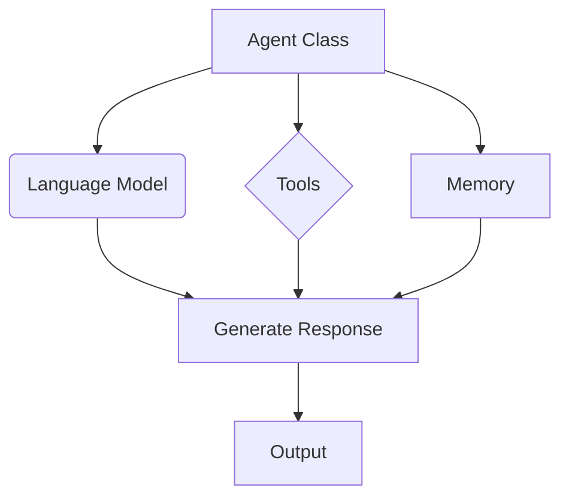
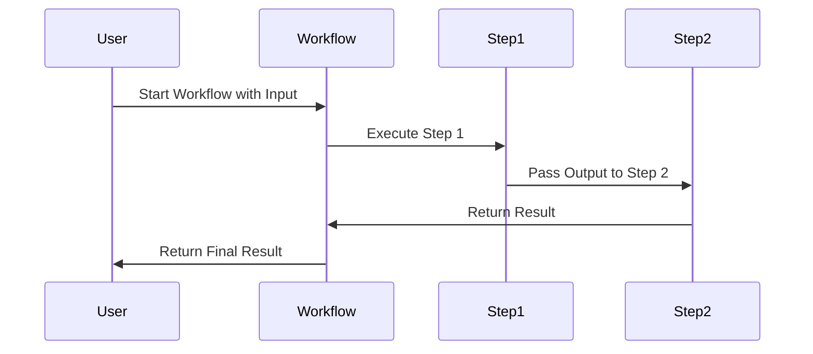
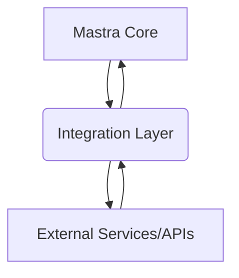
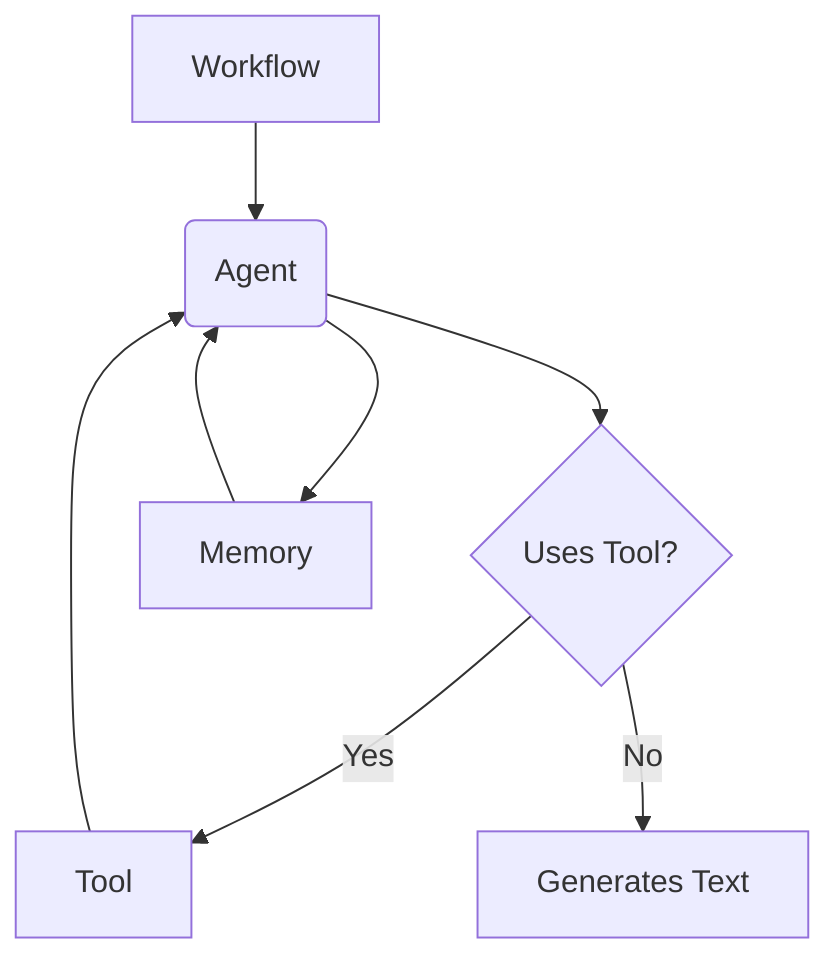
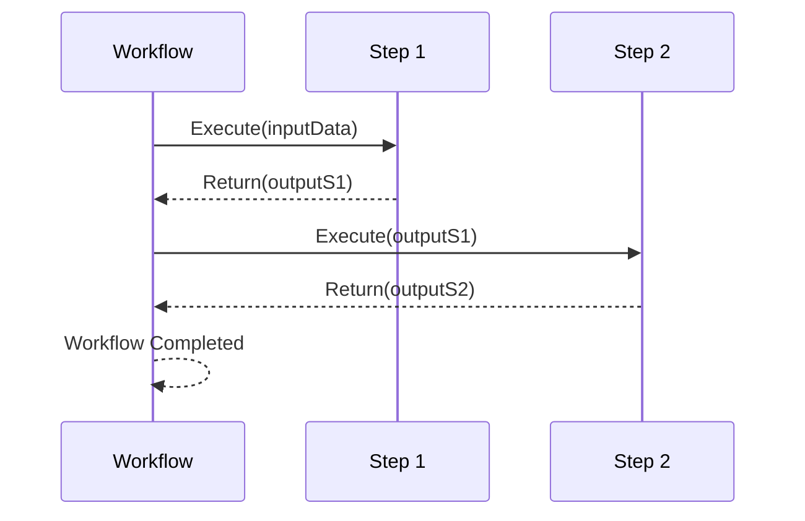
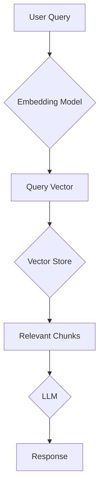
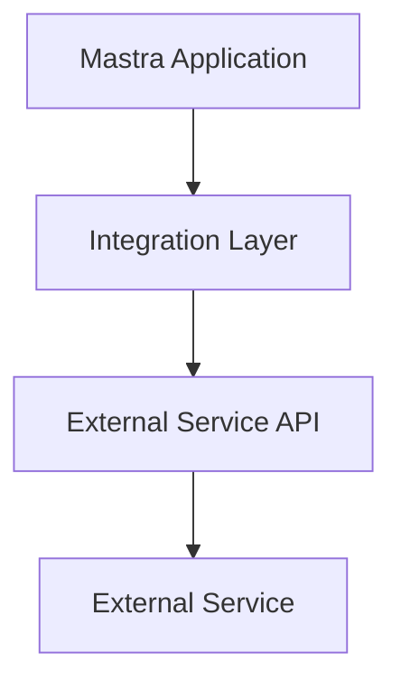
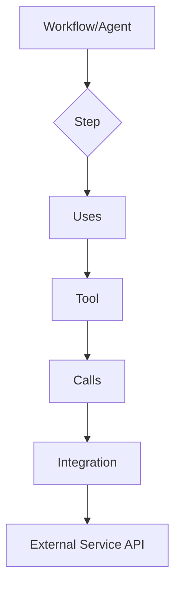

# Wiki Documentation for https://github.com/mastra-ai/mastra

Generated on: 2025-05-27 01:17:51

## Table of Contents

- [Architecture Overview](#page-1)
- [Agents and Tools](#page-2)
- [Workflows and Execution](#page-3)
- [RAG Implementation](#page-4)
- [Deployment and Configuration](#page-5)
- [Integrations and APIs](#page-6)

<a id='page-1'></a>

## Architecture Overview

### Related Files

- `packages/core/src/index.ts`
- `packages/core/src/agent/index.ts`
- `packages/core/src/workflows/index.ts`
- `packages/core/src/rag/index.ts`
- `packages/core/src/integration/index.ts`

### Related Pages

Related topics: [Agents and Tools](#page-2), [Workflows and Execution](#page-3)

## Architecture Overview of Mastra

Mastra is a TypeScript framework designed for building AI applications, providing tools for creating agents, workflows, RAG systems, and integrations. This page provides an overview of the core architectural components, focusing on key files within the `packages/core/src` directory.

### 1. Core (`index.ts`)

The `index.ts` file serves as the entry point for the `@mastra/core` package. It aggregates and exports the essential modules, classes, and functions required to build AI-powered applications.

**Functionality:**

-   Exports key components like `Agent`, `Workflow`, `Step`, and utility functions.
-   Provides a central point for importing and utilizing Mastra's core functionalities.
-   Initializes and configures the Mastra environment.

**Code Example:**

```typescript filename="packages/core/src/index.ts"
export * from './agent';
export * from './workflows';
export * from './rag';
export * from './integration';
// Additional exports as needed
```

**Explanation:**

This file acts as a central hub, making it easier for developers to import and use Mastra's core features in their projects.

**Overall Architecture:**

`index.ts` ties together different modules, making them accessible as a single package.

### 2. Agent (`agent/index.ts`)

The `agent/index.ts` file defines the `Agent` class, which represents an intelligent agent capable of performing tasks, making decisions, and interacting with its environment.

**Functionality:**

-   Defines the `Agent` class with properties like `name`, `instructions`, `model`, `tools`, and `memory`.
-   Provides methods for generating responses using a specified language model.
-   Enables agents to use tools and access memory for enhanced capabilities.

**Code Example:**

```typescript filename="packages/core/src/agent/index.ts"
import { OpenAI } from 'openai';

export class Agent {
  name: string;
  instructions: string;
  model: OpenAI;
  tools: any;
  memory: any;

  constructor(config: { name: string; instructions: string; model: OpenAI; tools?: any; memory?: any }) {
    this.name = config.name;
    this.instructions = config.instructions;
    this.model = config.model;
    this.tools = config.tools;
    this.memory = config.memory;
  }

  async generate(prompt: string) {
    // Implementation for generating responses using the language model
    const completion = await this.model.completions.create({
      engine: 'davinci',
      prompt: `${this.instructions}\n${prompt}`,
      max_tokens: 100,
    });
    return completion.choices[0].text.trim();
  }
}
```

**Explanation:**

The `Agent` class encapsulates the logic and data required for an AI agent to operate effectively. The `generate` method uses a language model to produce responses based on given instructions and prompts.

**Overall Architecture:**

The `Agent` class is a fundamental building block in Mastra's architecture, enabling the creation of autonomous entities that can perform complex tasks.

**Component Relationships:**



### 3. Workflows (`workflows/index.ts`)

The `workflows/index.ts` file defines the `Workflow` and `Step` classes, which allow developers to create structured, multi-step processes for AI applications.

**Functionality:**

-   Defines the `Workflow` class for creating and managing complex workflows.
-   Defines the `Step` class for encapsulating individual tasks within a workflow.
-   Provides methods for defining the sequence and dependencies of steps.

**Code Example:**

```typescript filename="packages/core/src/workflows/index.ts"
export class Workflow {
  name: string;
  steps: Step[];

  constructor(config: { name: string; steps: Step[] }) {
    this.name = config.name;
    this.steps = config.steps;
  }

  async execute(input: any) {
    let result = input;
    for (const step of this.steps) {
      result = await step.execute(result);
    }
    return result;
  }
}

export class Step {
  id: string;
  execute: (input: any) => Promise<any>;

  constructor(config: { id: string; execute: (input: any) => Promise<any> }) {
    this.id = config.id;
    this.execute = config.execute;
  }
}
```

**Explanation:**

The `Workflow` class allows developers to define a series of `Step` instances that are executed in a specific order. Each `Step` performs a specific task, and the output of one step can be used as the input for the next.

**Overall Architecture:**

Workflows provide a structured way to define and manage complex AI processes, making it easier to build sophisticated applications.

**Data Flow:**



### 4. RAG (`rag/index.ts`)

The `rag/index.ts` file provides functionalities for implementing Retrieval-Augmented Generation (RAG) systems, which enhance language model performance by retrieving relevant information from external sources.

**Functionality:**

-   Defines classes and functions for indexing, retrieving, and integrating external knowledge into language model prompts.
-   Supports various data sources and indexing strategies.
-   Enables the creation of RAG pipelines for improved question answering and content generation.

**Code Example:**

```typescript filename="packages/core/src/rag/index.ts"
export class RAG {
  // Implementation for RAG functionality
  constructor() {}

  async retrieve(query: string) {
    // Logic to retrieve relevant information from external sources
    return `Relevant information for query: ${query}`;
  }

  async generate(query: string, context: string) {
    // Logic to generate responses using the language model and retrieved context
    return `Response to query: ${query} with context: ${context}`;
  }
}
```

**Explanation:**

The RAG system retrieves relevant information based on a query and uses it to augment the language model's generation process, resulting in more accurate and context-aware responses.

**Overall Architecture:**

RAG enhances the capabilities of language models by providing them with access to external knowledge, making them more versatile and effective.

### 5. Integration (`integration/index.ts`)

The `integration/index.ts` file defines functionalities for integrating Mastra with external services, tools, and APIs.

**Functionality:**

-   Provides a standardized way to connect Mastra agents and workflows with external resources.
-   Supports various integration patterns, such as API calls, data synchronization, and event handling.
-   Enables the creation of custom integrations to meet specific application requirements.

**Code Example:**

```typescript filename="packages/core/src/integration/index.ts"
export class Integration {
  // Implementation for integration functionality
  constructor() {}

  async connect(service: string) {
    // Logic to connect to an external service
    return `Connected to service: ${service}`;
  }

  async callAPI(api: string, params: any) {
    // Logic to call an external API
    return `API response for ${api} with params ${params}`;
  }
}
```

**Explanation:**

The `Integration` class provides a way to connect Mastra components with external services, allowing agents and workflows to interact with real-world data and systems.

**Overall Architecture:**

Integrations are essential for making Mastra applications more versatile and capable of interacting with a wide range of external resources.

**Component Relationships:**



### Setup and Usage Instructions

To use these core components:

1.  **Installation:**

    ```bash
    npm install @mastra/core
    ```
2.  **Import Modules:**

    ```typescript
    import { Agent, Workflow, Step, RAG, Integration } from '@mastra/core';
    ```
3.  **Implement Agents and Workflows:**

    Create instances of the `Agent` and `Workflow` classes, defining their behavior and interactions.
4.  **Integrate External Services:**

    Use the `Integration` class to connect Mastra components with external services and APIs.
5.  **Implement RAG Systems:**

    Use the `RAG` class to retrieve and integrate external knowledge into language model prompts.

By understanding and utilizing these core components, developers can build powerful and versatile AI applications with Mastra.


---

<a id='page-2'></a>

## Agents and Tools

### Related Files

- `packages/core/src/agent/index.ts`
- `packages/core/src/tools/index.ts`
- `docs/src/content/en/docs/agents/overview.mdx`
- `docs/src/content/en/docs/agents/adding-tools.mdx`
- `packages/core/src/memory/index.ts`

### Related Pages

Related topics: [Architecture Overview](#page-1), [Workflows and Execution](#page-3)

## Agents and Tools in Mastra

Mastra uses **Agents** as autonomous AI entities. Agents use **Memory** to maintain context and use **Tools** to interact with external systems. This page provides an overview of these components and how they work together within the Mastra framework.

### What are Agents?

Agents are the central intelligence units in Mastra applications. They encapsulate interactions with Language Models (LLMs), manage conversation history, and can be equipped with specific behaviors and capabilities through `instructions` and `tools`. The `Agent` class is a fundamental building block defined in `packages/core/src/agent/index.ts`.

**Purpose and Functionality:**

-   **Instruction Following:** Agents are given specific instructions (`instructions` property) that guide their behavior and responses.
-   **Model Interaction:** They manage the connection and interaction with underlying LLMs (`model` property).
-   **Tool Usage:** Agents can be given a set of tools (`tools` property) they can call upon to perform actions outside of their core language generation capabilities.
-   **Memory Management:** Agents can maintain state and conversation history using a `memory` instance, allowing for context-aware interactions.

Here's a basic example of defining an Agent:

```typescript
// packages/core/src/agent/index.ts
import { Agent } from '@mastra/core/agent';
import { openai } from '@ai-sdk/openai';

const agent = new Agent({
  name: 'my-agent',
  instructions: 'Your task-specific instructions',
  model: openai('gpt-4o-mini'),
  tools: {}, // Optional tools
});
```

Agents often leverage **Memory** (`packages/core/src/memory/index.ts`) to retain information across interactions. This can include conversation history, retrieved documents (in RAG scenarios), or other relevant data.

```typescript
// packages/core/src/memory/index.ts
import { Memory } from '@mastra/memory';
import { Agent } from '@mastra/core/agent';
import { openai } from '@ai-sdk/openai';
import { LibSQLStore } from '@mastra/libsql';

const agentWithMemory = new Agent({
  name: 'Project Manager',
  instructions: 'You are a project manager assistant.',
  model: openai('gpt-4o-mini'),
  memory: new Memory({
    storage: new LibSQLStore({
      url: "file:../mastra.db", // path is relative to the .mastra/output directory
    })
  }),
});
```

### What are Tools?

Tools (`packages/core/src/tools/index.ts`) are functions or capabilities that Agents can use to perform specific actions. These actions can range from searching the web, reading files, interacting with APIs, or executing code. Tools extend the agent's abilities beyond just generating text.

**Purpose and Functionality:**

-   **External Interaction:** Tools allow agents to interact with systems or data outside the LLM.
-   **Specific Tasks:** They provide specialized capabilities like data retrieval, calculations, or system commands.
-   **Structured Interface:** Each tool has a clear description and schema, helping the LLM understand when and how to use it.

Tools are typically added to an Agent during its initialization (`docs/src/content/en/docs/agents/adding-tools.mdx`).

```typescript
// packages/core/src/tools/index.ts
import { Agent } from '@mastra/core/agent';
import { openai } from '@ai-sdk/openai';
import { createTool } from '@mastra/core/tools';
import { z } from 'zod';

// Define a simple tool
const weatherTool = createTool({
  name: 'getWeather',
  description: 'Gets the current weather for a location.',
  parameters: z.object({
    location: z.string().describe('The city and state, e.g. San Francisco, CA'),
  }),
  execute: async ({ location }) => {
    // In a real tool, you'd call a weather API here
    console.log(`Fetching weather for ${location}...`);
    return { temperature: '20°C', conditions: 'Sunny' };
  },
});

// Create an agent and give it the tool
const weatherAgent = new Agent({
  name: 'Weather Agent',
  instructions: 'You are a helpful assistant that can tell the weather.',
  model: openai('gpt-4o-mini'),
  tools: { weatherTool }, // Add the tool here
});

// An agent can then potentially call this tool based on user input
// await weatherAgent.generate('What is the weather in London?');
```

Mastra also provides the Model Context Protocol (MCP) which allows agents to discover and use tools dynamically from external servers.

### Architecture Fit

Agents and Tools are foundational components of the Mastra framework. They are often orchestrated within **Workflows**. A workflow defines a sequence or graph of steps, where each step can involve an agent using its tools or performing other operations. This allows for building complex, multi-step AI applications by combining simpler agent capabilities.

For example, a workflow might use one agent to gather information using a web scraping tool, another agent to summarize that information, and a third agent to format the final output.

This architecture promotes modularity and reusability, as agents and tools can be defined once and used across different workflows or parts of an application.

Here's a simplified view of how these components interact:



### Setup and Usage

To use Agents and Tools in your Mastra project, you typically need to:

1.  Install the core package:

    ```bash
npm install @mastra/core
    ```
    or if using pnpm:
    ```bash
pnpm install @mastra/core
    ```

2.  Set up your environment variables, especially for your chosen LLM provider (e.g., `OPENAI_API_KEY`, `ANTHROPIC_API_KEY`), often in a `.env` file.

3.  Define your agents and tools in your project's code, typically within a dedicated directory like `src/mastra/agents` and `src/mastra/tools`.

4.  Integrate your agents and tools into workflows or use them directly in your application logic.

By leveraging Agents, Tools, and Memory, developers can build sophisticated AI applications with Mastra that can perform complex tasks and maintain context over time.


---

<a id='page-3'></a>

## Workflows and Execution

### Related Files

- `packages/core/src/workflows/index.ts`
- `docs/src/content/en/docs/workflows/overview.mdx`
- `packages/core/src/workflows/legacy/index.ts`

### Related Pages

Related topics: [Architecture Overview](#page-1), [Agents and Tools](#page-2)

## Workflows and Execution

Mastra Workflows provide a structured way to define and execute complex AI tasks. They allow you to orchestrate Agents, Tools, and custom logic into reusable and maintainable units. This page focuses on the vNext workflow API located in `packages/core/src/workflows/index.ts`, contrasting it with the legacy API found in `packages/core/src/workflows/legacy/index.ts`. The `docs/src/content/en/docs/workflows/overview.mdx` file provides a high-level overview of workflows.

### Purpose and Functionality

Workflows enable you to:

*   **Orchestrate Steps:** Define a sequence of operations (Steps) to achieve a specific goal.
*   **Manage Control Flow:** Implement sequential execution, parallel processing, conditional branching, and looping.
*   **Integrate Components:** Seamlessly incorporate Agents, Tools, and custom functions within workflow steps.
*   **Ensure Type Safety:** Define clear input and output schemas for workflows and steps using Zod.
*   **Handle State:** Manage data flow between steps and handle user interaction via suspend/resume points.

### Key Concepts

*   **Workflows:** High-level orchestrators that define the overall structure and flow of execution.
*   **Steps:** Atomic units of work within a workflow. Each step has a defined input and output schema and contains the logic (`execute` function) to perform a specific task.

### Workflow Structure and Flow Control (vNext)

Mastra vNext workflows offer several ways to control execution flow:

#### Sequential Flow

Steps are executed one after another using the `.then()` method. The output of the previous step becomes the input for the next step.

```typescript
// packages/core/src/workflows/index.ts
import { createWorkflow, createStep } from '@mastra/core/workflows';
import { z } from 'zod';

// Define step1 with input and output schemas and an execute function
const step1 = createStep({
  id: 'step1',
  inputSchema: z.object({ message: z.string() }),
  outputSchema: z.object({ processedMessage: z.string() }),
  execute: async ({ inputData }) => {
    console.log('Step 1 received:', inputData.message);
    return { processedMessage: inputData.message.toUpperCase() };
  },
});

// Define step2 with input and output schemas and an execute function
const step2 = createStep({
  id: 'step2',
  inputSchema: z.object({ processedMessage: z.string() }),
  outputSchema: z.object({ finalResult: z.string() }),
  execute: async ({ inputData }) => {
    console.log('Step 2 received:', inputData.processedMessage);
    return { finalResult: `Final: ${inputData.processedMessage}` };
  },
});

// Create a workflow, defining the input and output schemas
export const sequentialWorkflow = createWorkflow({
  id: 'sequential-workflow',
  inputSchema: z.object({ message: z.string() }),
  outputSchema: z.object({ finalResult: z.string() }),
})
  .then(step1)
  .then(step2)
  .commit(); // Commit the workflow definition
```

#### Parallel Execution

The `.parallel()` method allows multiple steps to execute concurrently. The output is a union of the results from the parallel steps.

```typescript
// packages/core/src/workflows/index.ts
// Example conceptual structure (syntax may vary slightly based on context)
workflow
  .then(stepA)
  .parallel([stepB, stepC]) // stepB and stepC run in parallel after stepA
  .then(stepD); // stepD runs after both stepB and stepC complete
```

#### Conditional Branching

The `.branch()` method replaces traditional if/else structures, providing clearer conditional paths. Each truthy condition executes its corresponding step or workflow path.

```typescript
// packages/core/src/workflows/index.ts
import { createWorkflow, createStep } from '@mastra/core/workflows/vNext';
import { z } from 'zod';

// Define steps for fetching weather and planning activities
const fetchWeather = createStep({ /* ... */ });
const planIndoorActivities = createStep({ /* ... */ });
const planActivities = createStep({ /* ... */ });

// Create a workflow that branches based on weather conditions
const weatherWorkflow = createWorkflow({
  id: 'weather-workflow-step2-if-else',
  inputSchema: z.object({ city: z.string() }),
  outputSchema: z.object({ activities: z.string() }),
})
  .then(fetchWeather)
  .branch([
    [
      async ({ inputData }) => {
        // Condition 1: Check if precipitation chance is > 50
        return inputData?.precipitationChance > 50;
      },
      planIndoorActivities,
    ],
    [
      async ({ inputData }) => {
        // Condition 2: Check if precipitation chance is <= 50
        return inputData?.precipitationChance <= 50;
      },
      planActivities,
    ],
  ]);

weatherWorkflow.commit(); // Commit the workflow definition
```

#### Loops

The `.dountil()` method allows a Step or Nested Workflow to repeat until a specified condition is met.

```typescript
// packages/core/src/workflows/index.ts
import { createWorkflow, createStep } from '@mastra/core/workflows/vNext';
import { z } from 'zod';

// Define steps for incrementing a value and performing a side effect
const incrementStep = createStep({ /* ... increments a value */ });
const sideEffectStep = createStep({ /* ... performs a side effect */ });
const finalStep = createStep({ /* ... */ });

// Create a workflow that loops until a condition is met
const incrementWorkflow = createWorkflow({
  id: 'increment-workflow',
  inputSchema: z.object({ value: z.number() }),
  outputSchema: z.object({ value: z.number() }),
})
  .dountil(
    createWorkflow({
      id: 'increment-subworkflow',
      inputSchema: z.object({ value: z.number() }),
      outputSchema: z.object({ value: z.number() }),
      steps: [incrementStep, sideEffectStep],
    })
      .then(incrementStep)
      .then(sideEffectStep)
      .commit(),
    async ({ inputData }) => inputData.value >= 10, // Loop condition
  )
  .then(finalStep)
  .commit();
```

### Data Flow and Context (vNext)

In vNext workflows, data flow is managed through step inputs and outputs, defined by Zod schemas.

*   The first step receives `inputData` from the workflow's initial trigger/start data.
*   Subsequent steps receive `inputData`, which is the output of the *previous* step in the sequence.
*   For parallel or branching paths, the input to the steps within those paths depends on how data is mapped or the output of the step *before* the parallel/branching block.
*   Steps can access the output of *any* previous step using `getStepResult(stepId)`.
*   Steps can access the initial workflow input data using `getInitData()`.

### Architecture Fit

Workflows are a fundamental primitive in Mastra, sitting above Agents, Tools, and Integrations. They act as the orchestration layer, defining the overall logic and flow of an AI application. Steps encapsulate the specific tasks, which might involve calling an Agent, using a Tool, interacting with an Integration, or executing custom code.

```mermaid
graph TD
    A[Mastra Application] --> B[Workflow]
    B --> C[Step 1]
    B --> D[Step 2]
    B --> E[Step N]
    C --> F[Agent]
    D --> G[Tool]
    E --> H[Integration]
    C --> I[Custom Logic]
    D --> I
    E --> I
    C --> D: Data Flow (.then)
    (C, D, E) --> B: Results
```

### Setup and Usage

To use workflows in your Mastra project:

1.  Ensure you have Node.js (v20.0+) and pnpm installed.
2.  Clone the Mastra repository.
3.  Navigate to your project directory (e.g., one of the examples).
4.  Install dependencies using `pnpm install`.
5.  Define your Steps using `createStep` with input and output schemas.
6.  Define your Workflow using `createWorkflow`, specifying the overall input and output schemas.
7.  Chain your Steps together using flow control methods like `.then()`, `.parallel()`, `.branch()`, or `.dountil()`.
8.  Call `.commit()` on the workflow to finalize its definition.
9.  Integrate your workflows into your `Mastra` instance configuration.

```typescript
// Example from examples/basics/agents/multi-agent-workflow/index.ts
import { createWorkflow, createStep } from '@mastra/core/workflows';
import { z } from 'zod';
import { Agent } from '@mastra/core';
import { anthropic } from '@ai-sdk/anthropic';
import { openai } from '@ai-sdk/openai';

// Define agents (used within steps)
const copywriterAgent = new Agent({
  name: 'Copywriter',
  instructions: 'You are a copywriter agent that writes blog post copy.',
  model: anthropic('claude-3-5-sonnet-20241022'),
});
const editorAgent = new Agent({
  name: 'Editor',
  instructions: 'You are an editor agent that edits blog post copy.',
  model: openai('gpt-4o-mini'),
});

// Define steps
const copywriterStep = createStep({
  id: 'copywriterStep',
  inputSchema: z.object({ topic: z.string() }),
  outputSchema: z.object({ copy: z.string() }),
  execute: async ({ inputData }) => {
    if (!inputData?.topic) {
      throw new Error('Topic not found in trigger data');
    }
    const result = await copywriterAgent.generate(`Create a blog post about ${inputData.topic}`);
    console.log('copywriter result', result.text);
    return {
      copy: result.text,
    };
  },
});
const editorStep = createStep({
  id: 'editorStep',
  inputSchema: z.object({ copy: z.string() }),
  outputSchema: z.object({ finalCopy: z.string() }),
  execute: async ({ inputData }) => {
    const copy = inputData?.copy;

    const result = await editorAgent.generate(`Edit the following blog post only returning the edited copy: ${copy}`);
    console.log('editor result', result.text);
    return {
      finalCopy: result.text,
    };
  },
});

// Define workflow and chain steps
const myWorkflow = createWorkflow({
  id: 'my-workflow',
  inputSchema: z.object({ topic: z.string() }),
  outputSchema: z.object({ finalCopy: z.string() }),
})
  .then(copywriterStep)
  .then(editorStep)
  .commit();

// Example of running the workflow
async function runExample() {
  const run = myWorkflow.createRun();
  const res = await run.start({ inputData: { topic: 'React JavaScript frameworks' } });
  console.log('Response: ', res);
}

runExample();
```

### Workflow Execution Flow

A simple sequential workflow execution involves the workflow coordinating the steps:



### Differences from Original Workflow API

The vNext workflow API (`@mastra/core/src/workflows/index.ts`) represents a significant evolution from the original API (`@mastra/core/src/workflows/legacy/index.ts` or older examples using `new Workflow`/`new Step`). Key differences include:

*   **Creation:** vNext uses functional `createWorkflow` and `createStep` instead of class instantiation (`new Workflow`, `new Step`).
*   **Schema Emphasis:** vNext requires explicit input and output schemas for steps and workflows using Zod, enhancing type safety.
*   **Data Access:** vNext uses `inputData` for the current step's input, `getStepResult` for accessing other step outputs, and `getInitData` for the initial workflow input, replacing the single `context` object pattern.
*   **Control Flow:** `.then()` is the universal connector in vNext, replacing `.step()`. New methods like `.parallel()`, `.branch()`, and `.dountil()` provide more structured control flow primitives compared to the original `.after([])` or nested workflow patterns.

While the original API is still present in some examples (`packages/core/src/workflows/legacy/index.ts` exists for backward compatibility or older examples), the recommended approach for new development is to use the vNext API.

#### Legacy Workflow Example

```typescript
// packages/core/src/workflows/legacy/index.ts
import { Workflow, Step } from '@mastra/core/workflows';
import { z } from 'zod';

// Define steps
const step1 = new Step({
  id: 'step1',
  execute: async ({ context }) => {
    console.log('Step 1 received:', context.triggerData.message);
    return { processedMessage: context.triggerData.message.toUpperCase() };
  },
});

const step2 = new Step({
  id: 'step2',
  execute: async ({ context }) => {
    console.log('Step 2 received:', context.getStepResult('step1').processedMessage);
    return { finalResult: `Final: ${context.getStepResult('step1').processedMessage}` };
  },
});

// Define workflow
const workflow = new Workflow({
  name: 'legacy-workflow',
  triggerSchema: z.object({ message: z.string() }),
});

// Chain steps
workflow.step(step1).step(step2).commit();
```

### Conclusion

Mastra's workflow system provides a way to build complex AI applications by orchestrating modular steps. The vNext API, with its emphasis on explicit schemas and structured control flow, offers improved type safety and developer experience compared to the original implementation.


---

<a id='page-4'></a>

## RAG Implementation

### Related Files

- `packages/rag/src/index.ts`
- `docs/src/content/en/docs/rag/overview.mdx`
- `packages/rag/src/document/index.ts`
- `packages/core/src/vector/index.ts`
- `stores/pg/src/vector/index.ts`

### Related Pages

Related topics: [Architecture Overview](#page-1)

## RAG Implementation in Mastra

This page details the implementation of Retrieval-Augmented Generation (RAG) within the Mastra framework. RAG enables Mastra agents to leverage external knowledge sources to enhance their responses, making them more informed and contextually relevant.

### Overview

RAG in Mastra involves several key steps: document processing, embedding generation, vector storage, and retrieval. The `@mastra/rag` package provides the necessary tools and abstractions to facilitate this process. This guide focuses on the core components involved in RAG, including document handling, vector store interfaces, and integration with Mastra agents and workflows.

### Core Components

The following files are central to Mastra's RAG implementation:

*   `packages/rag/src/index.ts`: Exports the main RAG-related tools and functionalities, such as `createVectorQueryTool` and `createGraphRAGTool`.
*   `docs/src/content/en/docs/rag/overview.mdx`: Provides a high-level overview of RAG concepts within the Mastra documentation.
*   `packages/rag/src/document/index.ts`: Defines the `MDocument` class, which represents a document and provides methods for chunking.
*   `packages/core/src/vector/index.ts`: Defines the `VectorStore` interface, which outlines the common methods for interacting with vector databases.
*   `stores/pg/src/vector/index.ts`: Implements the `PgVector` class, a concrete `VectorStore` implementation for PostgreSQL using the `pgvector` extension.

### Document Processing with `MDocument`

The `MDocument` class (defined in `packages/rag/src/document/index.ts`) is a fundamental building block for RAG. It represents a text document and provides methods for processing and chunking the document into smaller segments.

#### Functionality

*   **Representation**: Encapsulates the text content and metadata of a document.
*   **Chunking**: Provides the `chunk()` method to split the document into smaller, more manageable chunks. Chunking is essential for efficient vector storage and retrieval.

#### Code Example

```typescript
// packages/rag/src/document/index.ts
import { MDocument } from '@mastra/rag';

const doc = new MDocument({
  text: 'This is the content of my document.',
  metadata: { source: 'my_document.txt' },
});

async function processDocument() {
  const chunks = await doc.chunk({
    strategy: 'recursive',
    size: 512,
    overlap: 50,
    separator: '\n',
  });
  console.log(`Document chunked into ${chunks.length} parts.`);
  return chunks;
}

processDocument();
```

#### Chunking Strategies

The `chunk()` method supports various chunking strategies, including:

*   **Recursive Chunking**: Splits the document recursively based on separators like newlines or sentences.
*   **Fixed-Size Chunking**: Splits the document into chunks of a fixed size.

### Vector Store Interface

The `VectorStore` interface (defined in `packages/core/src/vector/index.ts`) provides an abstraction layer for interacting with different vector databases. This allows Mastra to support various vector store implementations without requiring changes to the core RAG logic.

#### Functionality

*   **Indexing**: Creates an index for efficient vector similarity search.
*   **Upserting**: Inserts or updates vectors in the vector store.
*   **Searching**: Retrieves vectors based on a query vector.

#### Code Example

```typescript
// packages/core/src/vector/index.ts
export interface VectorStore {
  createIndex(options: CreateIndexOptions): Promise<void>;
  upsert(options: UpsertOptions): Promise<void>;
  search(options: SearchOptions): Promise<VectorSearchResult[]>;
}
```

### PostgreSQL Vector Store Implementation

The `PgVector` class (defined in `stores/pg/src/vector/index.ts`) is a concrete implementation of the `VectorStore` interface for PostgreSQL using the `pgvector` extension.

#### Functionality

*   **PostgreSQL Integration**: Connects to a PostgreSQL database and utilizes the `pgvector` extension for vector storage and similarity search.
*   **Index Management**: Creates and manages vector indexes within the PostgreSQL database.
*   **Vector Operations**: Provides methods for upserting and searching vectors.

#### Code Example

```typescript
// stores/pg/src/vector/index.ts
import { PgVector } from '@mastra/pg';

const pgVector = new PgVector({
  connectionString: process.env.POSTGRES_CONNECTION_STRING!,
});

async function setupVectorStore() {
  await pgVector.createIndex({
    indexName: 'my_index',
    dimension: 1536,
  });
  console.log('Vector index created.');
}

setupVectorStore();
```

### RAG Tools

The `@mastra/rag` package exports tools that facilitate RAG operations within Mastra agents and workflows. These tools include `createVectorQueryTool` and `createGraphRAGTool` (defined in `packages/rag/src/index.ts`).

#### `createVectorQueryTool`

This tool enables agents to perform vector similarity searches against a configured vector store.

*   **Functionality**: Takes a query, converts it into a vector embedding, and searches the vector store for similar vectors.
*   **Usage**: Allows agents to retrieve relevant context from external knowledge sources based on the user's query.

#### `createGraphRAGTool`

This tool implements a Graph RAG approach, enhancing retrieval and ranking by considering relationships between different text chunks.

*   **Functionality**: Constructs a graph of text chunks based on their similarity and uses graph algorithms to improve retrieval accuracy.
*   **Usage**: Enables agents to leverage the relationships between different pieces of information to provide more comprehensive and contextually relevant answers.

#### Code Example

```typescript
// packages/rag/src/index.ts
import { openai } from '@ai-sdk/openai';
import { createVectorQueryTool } from '@mastra/rag';

const vectorQueryTool = createVectorQueryTool({
  vectorStoreName: 'pgVector', // Name registered with Mastra instance
  indexName: 'embeddings',
  model: openai.embedding('text-embedding-3-small'),
});
```

### RAG Workflow

The following diagram illustrates the typical RAG workflow within Mastra:



1.  A user submits a query.
2.  The query is converted into a vector embedding using an embedding model.
3.  The vector store is searched for similar vectors.
4.  Relevant text chunks are retrieved from the vector store.
5.  The retrieved chunks are passed as context to a Language Model (LLM).
6.  The LLM generates a response based on the context.

### Integration with Mastra Agents

RAG tools can be integrated into Mastra agents to enable them to leverage external knowledge sources.

#### Code Example

```typescript
import { Agent } from '@mastra/core/agent';
import { createVectorQueryTool } from '@mastra/rag';
import { openai } from '@ai-sdk/openai';

const vectorQueryTool = createVectorQueryTool({
  vectorStoreName: 'pgVector',
  indexName: 'embeddings',
  model: openai.embedding('text-embedding-3-small'),
});

const ragAgent = new Agent({
  name: 'RAG Agent',
  instructions: 'You are a helpful assistant that answers questions based on the provided context.',
  model: openai('gpt-4o-mini'),
  tools: {
    vectorQueryTool,
  },
});
```

In this example, the `vectorQueryTool` is added to the agent's `tools` object, allowing the agent to use the tool to retrieve relevant context from the vector store.

### Setup and Usage Instructions

To use the RAG module in Mastra:

1.  **Install the `@mastra/rag` package**:

    ```bash
    npm install @mastra/rag
    ```

2.  **Configure a vector store**: Set up a vector database (e.g., PostgreSQL with `pgvector`) and configure the connection string.

3.  **Register the vector store with the Mastra instance**:

    ```typescript
    import { Mastra } from '@mastra/core';
    import { PgVector } from '@mastra/pg';

    const pgVector = new PgVector({ connectionString: process.env.POSTGRES_CONNECTION_STRING! });

    const mastra = new Mastra({
      vectors: { pgVector },
    });
    ```

4.  **Create and configure RAG tools**:

    ```typescript
    import { openai } from '@ai-sdk/openai';
    import { createVectorQueryTool } from '@mastra/rag';

    const vectorQueryTool = createVectorQueryTool({
      vectorStoreName: 'pgVector',
      indexName: 'embeddings',
      model: openai.embedding('text-embedding-3-small'),
    });
    ```

5.  **Integrate RAG tools into Mastra agents**: Add the RAG tools to the agent's `tools` object.

6.  **Run RAG workflows**: Use the agents with RAG tools in Mastra workflows to process documents, generate embeddings, and retrieve relevant context for answering questions.

### Example: Basic RAG Workflow

The following example demonstrates a basic RAG workflow using Mastra, OpenAI, and PgVector:

1.  **Load a document**:

    ```typescript
    import { MDocument } from '@mastra/rag';

    const doc = new MDocument({
      text: 'This is the content of my document.',
      metadata: { source: 'my_document.txt' },
    });
    ```

2.  **Chunk the document**:

    ```typescript
    const chunks = await doc.chunk({
      strategy: 'recursive',
      size: 512,
      overlap: 50,
      separator: '\n',
    });
    ```

3.  **Generate embeddings**:

    ```typescript
    import { openai } from '@ai-sdk/openai';
    import { embedMany } from 'ai';

    const { embeddings } = await embedMany({
      model: openai.embedding('text-embedding-3-small'),
      values: chunks.map(chunk => chunk.text),
    });
    ```

4.  **Upsert embeddings into the vector store**:

    ```typescript
    const vectorStore = mastra.getVector('pgVector');
    await vectorStore.upsert({
      indexName: 'embeddings',
      vectors: embeddings,
      metadata: chunks.map(chunk => ({ text: chunk.text })),
    });
    ```

5.  **Create a RAG agent**:

    ```typescript
    import { Agent } from '@mastra/core/agent';
    import { createVectorQueryTool } from '@mastra/rag';

    const vectorQueryTool = createVectorQueryTool({
      vectorStoreName: 'pgVector',
      indexName: 'embeddings',
      model: openai.embedding('text-embedding-3-small'),
    });

    const ragAgent = new Agent({
      name: 'RAG Agent',
      instructions: 'You are a helpful assistant that answers questions based on the provided context.',
      model: openai('gpt-4o-mini'),
      tools: {
        vectorQueryTool,
      },
    });
    ```

6.  **Query the agent**:

    ```typescript
    const query = 'What is this document about?';
    const response = await ragAgent.generate(query);
    console.log(response.text);
    ```

### Further Reading

*   [`@mastra/rag` README](/packages/rag/README.md)
*   [MDocument Documentation](https://mastra.ai/reference/rag/document)
*   [Contributing to Docs](/docs/README.md)
*   [Reference Guide Writing Guidelines](/docs/reference-guide.md)

---

<a id='page-5'></a>

## Deployment and Configuration

### Related Files

- `packages/deployer/src/index.ts`
- `docs/src/content/en/docs/deployment/deployment.mdx`
- `packages/cli/src/commands/deploy/index.ts`
- `packages/cli/src/commands/dev/dev.ts`

### Related Pages

Related topics: [Architecture Overview](#page-1)

# Deployment and Configuration

Mastra's deployment and configuration involve the `@mastra/deployer` package, the CLI commands (`dev` and `deploy`), and associated configuration files. This system facilitates building, packaging, and deploying Mastra applications, as well as streamlining local development.

## `@mastra/deployer` Package

The `@mastra/deployer` package is the core component for transforming Mastra project source code into a runnable application. It manages the build process, dependencies, and environment variables.

**Purpose and Functionality:**

-   Builds and bundles Mastra code.
-   Manages project dependencies within the monorepo.
-   Handles environment variables from `.env` files.
-   Manages the `.mastra` directory structure.
-   Supports local development and production deployments.

**`packages/deployer/src/index.ts`**

This file is the main entry point for the `@mastra/deployer` package.

```typescript
// packages/deployer/src/index.ts
import { writeFile } from 'fs/promises';
import { join } from 'path';
import { createChildProcessLogger } from '@mastra/deployer';
import virtual from '@rollup/plugin-virtual';

export class Deployer {
  // ... class properties and methods ...
}
```

This code snippet shows the import statements at the beginning of the `index.ts` file. It imports modules for file system operations, path manipulation, child process logging, and Rollup plugins.

```typescript
// packages/deployer/src/index.ts
constructor({
    scope,
    env,
    projectName = 'mastra',
    routes,
    workerNamespace,
    auth,
    d1Databases,
    kvNamespaces,
  }: {
    env?: Record<string, any>;
    scope: string;
    projectName?: string;
    routes?: CFRoute[];
    workerNamespace?: string;
    auth: {
      apiToken: string;
      apiEmail?: string;
    };
    d1Databases?: D1DatabaseBinding[];
    kvNamespaces?: KVNamespaceBinding[];
  }) {
    super({ name: 'CLOUDFLARE' });

    this.scope = scope;
    this.projectName = projectName;
    this.routes = routes;
    this.workerNamespace = workerNamespace;

    if (env) {
      this.env = env;
    }

    if (d1Databases) this.d1Databases = d1Databases;
    if (kvNamespaces) this.kvNamespaces = kvNamespaces;

    this.cloudflare = new Cloudflare(auth);
  }
```

This constructor initializes the `CloudflareDeployer` class with configuration options such as scope, environment variables, project name, routes, worker namespace, authentication details, D1 databases, and KV namespaces. It also instantiates the `Cloudflare` client for interacting with the Cloudflare API.

```typescript
// packages/deployer/src/index.ts
async writeFiles(outputDirectory: string): Promise<void> {
    const env = await this.loadEnvVars();
    const envsAsObject = Object.assign({}, Object.fromEntries(env.entries()), this.env);

    const cfWorkerName = this.projectName;

    const wranglerConfig: Record<string, any> = {
      name: cfWorkerName,
      main: './index.mjs',
      compatibility_date: '2025-04-01',
      compatibility_flags: ['nodejs_compat', 'nodejs_compat_populate_process_env'],
      observability: {
        traces: true,
        metrics: true,
        debug: true,
      },
      vars: envsAsObject,
    };

    await writeFile(join(outputDirectory, 'wrangler.toml'), tomlStringify(wranglerConfig));
  }
```

This method generates a `wrangler.toml` configuration file for Cloudflare Workers. It sets the worker name, main entry point, compatibility settings, observability options, and environment variables.

**Key Features:**

*   Manages the `.mastra` directory.
*   Generates and updates the build-specific `package.json` within `.mastra`.
*   Automatically installs and resolves dependencies.
*   Supports `.env`, `.env.development`, and `.env.local` files.
*   Includes build process handling.
*   Provides support for development features like server configuration.

**Usage Example (within code):**

```typescript
import { Deployer } from '@mastra/deployer';

// Create a deployer instance for a project directory
const deployer = new Deployer({
  dir: '/path/to/your/mastra/project',
  type: 'Deploy', // Use 'Dev' for local development mode
});

// Install dependencies required for the build
await deployer.install();

// Generate the package.json file in the .mastra directory
await deployer.writePackageJson();

// Get the Mastra instance from the built project
const { mastra } = await deployer.getMastra();

// ... further build or deployment logic
```

The `dir` parameter specifies the root of your Mastra project, and `type` indicates whether you are preparing for a `Deploy` or running in `Dev` mode.

**Project Structure Managed by Deployer:**

The deployer creates a `.mastra` directory within your project root, containing the necessary files for execution:

```
your-project/
├── .mastra/
│   ├── package.json  // Dependencies for the built app
│   ├── mastra.mjs    // Entry point for the Mastra app
│   └── index.mjs     // Server entry point (often uses mastra.mjs)
├── .env              // Environment variables
├── .env.development
├── .env.local
└── package.json      // Your project's package.json
```

## Mastra CLI Commands (`dev` and `deploy`)

The Mastra CLI provides the primary interface for developers to interact with the `@mastra/deployer` package.

*   **`mastra dev`**: Used for local development. It invokes the deployer in `Dev` mode, builds your project into the `.mastra` directory, installs dependencies, and starts a local development server, typically including the interactive playground UI.
*   **`mastra deploy`**: Used to prepare your project for deployment. It invokes the deployer in `Deploy` mode, builds your project into the `.mastra` directory, and prepares the necessary artifacts. Recent updates have focused on refining this command to produce a standard build output that can then be picked up by platform-specific deployment tools or scripts.

**`packages/cli/src/commands/deploy/index.ts`**

This file defines the `deploy` command for the Mastra CLI.

```typescript
// packages/cli/src/commands/deploy/index.ts
import { Args, Command, Flags } from '@oclif/core';
import { build } from 'esbuild';
import * as fs from 'node:fs/promises';
import * as path from 'node:path';

export default class Deploy extends Command {
  // ... command properties and methods ...
}
```

This code snippet shows the import statements at the beginning of the `index.ts` file for the `deploy` command. It imports modules from `@oclif/core` for defining commands and flags, `esbuild` for building the project, and `fs` and `path` for file system operations.

**`packages/cli/src/commands/dev/dev.ts`**

This file defines the `dev` command for the Mastra CLI.

```typescript
// packages/cli/src/commands/dev/dev.ts
import { Flags } from '@oclif/core';
import { execa } from 'execa';
import * as fs from 'node:fs/promises';
import * as path from 'node:path';
import { WebSocketServer } from 'ws';

export default class Dev extends Command {
  // ... command properties and methods ...
}
```

This code snippet shows the import statements at the beginning of the `dev.ts` file for the `dev` command. It imports modules from `@oclif/core` for defining flags, `execa` for running external commands, `fs` and `path` for file system operations, and `ws` for creating a WebSocket server.

**Usage Examples (CLI):**

To run your Mastra project locally for development:

```bash
mastra dev
```

To build your project for deployment:

```bash
mastra deploy
```

## Architecture Fit

The deployment and configuration system sits between your Mastra project source code and the target execution environment (local machine, server, serverless function). The `@mastra/deployer` acts as a crucial build layer, standardizing the output regardless of the original project structure or the final deployment target. The Mastra CLI provides the user-friendly command-line interface to trigger this process. Platform-specific deployers (like `@mastra/deployer-cloudflare`) extend the base `Deployer` to add environment-specific logic for packaging and uploading the built application.

## Setup and Usage Instructions

1.  **Install Dependencies:** Ensure you have Node.js (v20.0+), pnpm (v9.7.0+), and Docker (for some local services) installed as per the main development guide.
2.  **Clone/Create Project:** Clone the Mastra repository or create a new Mastra project.
3.  **Install Project Dependencies:** Run `pnpm install` in the project root (or `npm install` for the docs, as noted in `docs/README.md`).
4.  **Configure Environment:** Copy `.env.example` to `.env` and configure necessary environment variables.
5.  **Local Development:** Run `mastra dev` to build and start the local development server and playground.
6.  **Deployment:** Run `mastra deploy` to build the project into the `.mastra` directory, preparing it for deployment using a platform-specific method.

## `docs/src/content/en/docs/deployment/deployment.mdx`

This file contains the documentation for deployment in Mastra. It likely covers the concepts, commands, and configurations discussed above.

## Visualization

The following diagram illustrates the relationship between the project source, the CLI, the deployer, and the build output:

```mermaid
graph TD
    A[Mastra Project Source] --> B[Mastra CLI (dev/deploy)];
    B --> C[@mastra/deployer Package];
    A --> D[Environment Files (.env)];
    D --> C;
    C --> E[.mastra Directory (Build Output)];
    E --> F[Platform Deployer / Manual Deployment];
    F --> G[Deployment Target (e.g., Cloudflare, Vercel, Node.js)];

    classDef package fill:#f9f,stroke:#333,stroke-width:2px;
    classDef cli fill:#ccf,stroke:#333,stroke-width:2px;
    classDef dir fill:#cfc,stroke:#333,stroke-width:2px;
    classDef env fill:#ffc,stroke:#333,stroke-width:2px;
    classDef target fill:#ccf,stroke:#333,stroke-width:2px;

    class C package;
    class B cli;
    class E dir;
    class D env;
    class G target;
```

This diagram shows how your source code and environment configuration are processed by the `@mastra/deployer` package, typically invoked by the Mastra CLI. The output is the `.mastra` directory, which contains the build artifacts ready to be deployed to a target environment using platform-specific tools or manual steps.


---

<a id='page-6'></a>

## Integrations and APIs

### Related Files

- `packages/core/src/integration/index.ts`
- `docs/src/content/en/docs/integrations.md`
- `integrations/github/src/index.ts`
- `packages/core/src/tools/index.ts`

### Related Pages

Related topics: [Agents and Tools](#page-2)

## Integrations and APIs

Mastra provides mechanisms for connecting to external services and extending its capabilities through **Integrations** and **Tools**. Integrations handle connections to external services, while Tools represent specific actions that can be performed, often leveraging integrations.

### Integrations

Integrations in Mastra facilitate connections to external APIs and services (e.g., GitHub, Firecrawl). They manage authentication, client creation, and often expose a `Toolset`.

**Purpose and Functionality**

The `Integration` class (defined in `packages/core/src/integration/index.ts`) manages configuration and client instances for external services. The GitHub Integration (`integrations/github/src/index.ts`) handles authentication and provides a client for GitHub API calls.

Integrations can expose a `Toolset`, a collection of related Tools utilizing the integration's client. The Firecrawl Integration defines a `FirecrawlToolset`.

**Architecture Fit**

Integrations act as intermediaries between core Mastra components (Workflows, Agents, Steps) and external services, providing a standardized interaction method.



**Setup and Usage**

Setting up an integration involves configuring credentials or API keys, often managed via environment variables.

For example, using GitHub or Firecrawl integrations in the `openapi-spec-writer` example requires setting environment variables like `GITHUB_API_KEY` and `FIRECRAWL_API_KEY`.

Within a Workflow or Step, access the integration's functionality by retrieving its API client or calling its exposed tools. The `github` integration is used in the `dane` example to get a client for making API calls:

```typescript
// packages/core/src/integration/index.ts
import { Integration } from '@mastra/core/integration';

export class MyIntegration extends Integration {
  // ... implementation details ...
}
```

```typescript
// integrations/github/src/index.ts
import { github } from '../integrations/index.js';

// Inside a Step's execute function:
const client = await github.getApiClient();

const issue = await client.issuesGet({
  path: {
    owner: context?.triggerData?.owner,
    repo: context?.triggerData?.repo,
    issue_number: context?.triggerData?.issue_number,
  },
});
```

### Tools

Tools (defined in `packages/core/src/tools/index.ts`) represent specific actions that Agents and Workflows can perform. They wrap logic interacting with external services (via Integrations) or perform other operations (e.g., reading files, web searching).

**Purpose and Functionality**

Tools are executable units providing Agents and Workflows the ability to interact with their environment or access information. Examples include `siteCrawlTool`, `generateSpecTool`, `addToGitHubTool`, and `docsTool`. Each tool has a specific function, input parameters, and output.

**Architecture Fit**

Tools are used within the `execute` function of a `Step` in a Workflow or directly by an Agent. They abstract implementation details (like API calls via an Integration) and provide a clean interface for performing actions.



**Usage**

Tools are created and called within the `execute` function of a Step. The `siteCrawlTool` is used in the `openapi-spec-writer` workflow:

```typescript
// packages/core/src/tools/index.ts
import { Tool } from '@mastra/core/tools';

export class MyTool extends Tool {
  // ... implementation details ...
}
```

```typescript
// Tool definition (simplified)
const siteCrawlTool = new Tool({
  // ... definition ...
  execute: async ({ context, runId, suspend }) => {
    // ... logic to call Firecrawl API via Integration ...
  }
});

// Used within a Step:
const syncStep = new Step({
  // ... definition ...
  execute: async ({ context, runId, suspend }) => {
    const toolResult = await siteCrawlTool.execute({
      context: context?.triggerData,
      runId,
      suspend,
    });
    // ... process toolResult ...
  },
});
```

Tools can be standalone or grouped into Toolsets, often provided by Integrations.

### Relationship between Integrations and Tools

Integrations and Tools work together. An Integration provides the connection layer and a client for an external service, while Tools leverage that client to perform specific tasks. This separation allows for modularity and reusability; the Integration handles 'how to connect', and the Tools handle 'what to do' with that connection.

In summary, Integrations manage connections to external services, and Tools provide the specific capabilities (often powered by Integrations) that your Mastra Workflows and Agents can execute.


---

